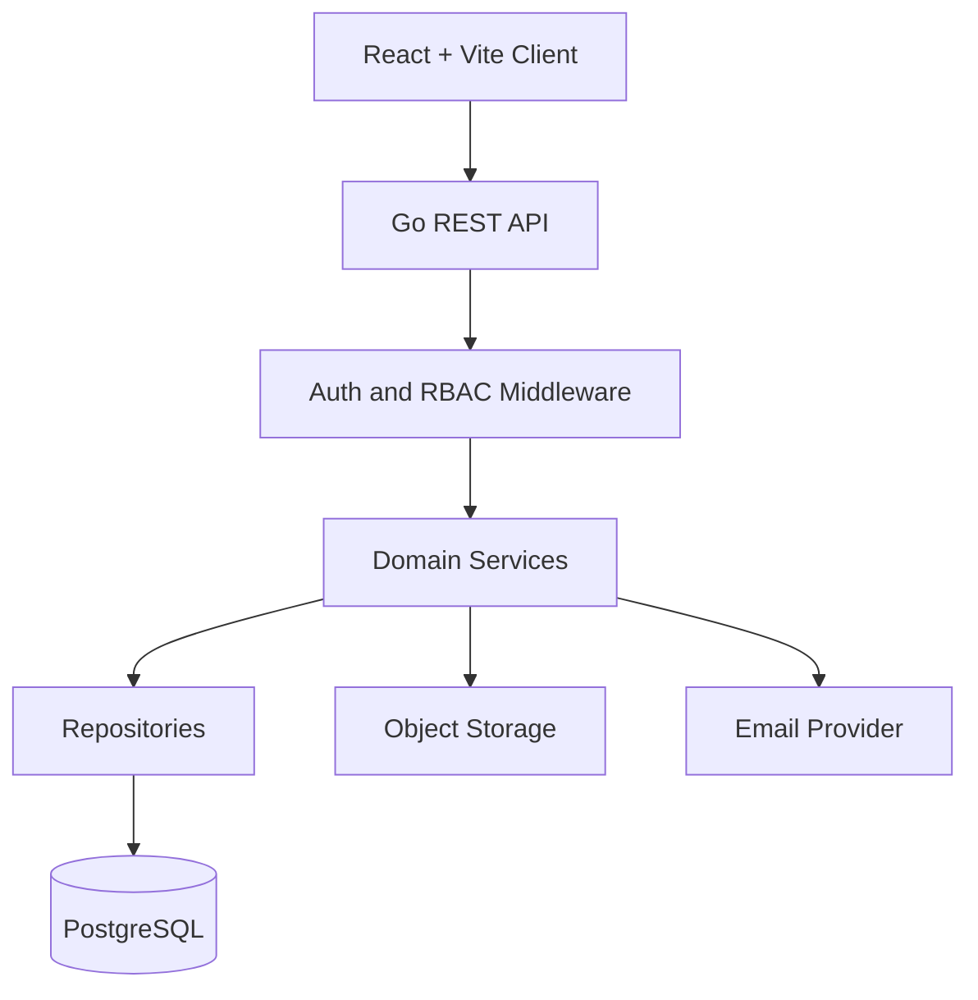
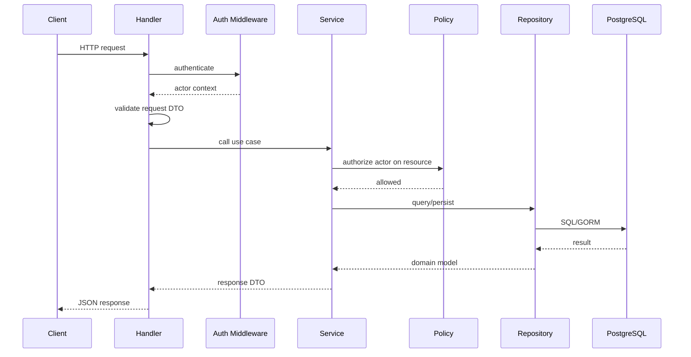

# Architecture

## Purpose

LINKS is the primary digital hub for MITT campus operations. The backend should support campus identity, targeted communication, event approval, placement workflows, public verified profiles, reports, and administration.

The first backend should be a **clean modular monolith** in Go. This keeps development and deployment simple while preserving strong internal boundaries.

## System Overview



## Architecture Choice

Use a modular monolith first.

Reasons:

- Campus workflows are highly connected.
- PostgreSQL transactions are valuable for approvals, applications, and audits.
- One deployable service is easier to operate.
- The project can later split modules into services if real scaling or team boundaries require it.

Avoid microservices in the MVP.

## Backend Layers

| Layer | Responsibility |
|---|---|
| Handler | HTTP binding, validation, actor extraction, response mapping |
| Service | Business rules, workflow orchestration, authorization, transactions |
| Repository | Database queries and persistence |
| Policy | Resource-specific permission checks |
| Model | Domain/database structs |
| DTO | Request and response types |

Rules:

- Handlers must not call GORM directly.
- Services must not depend on Gin.
- Repositories must not decide business permissions.
- Domain rules should be testable without HTTP.

## Recommended Backend Structure

```text
server/
  cmd/
    api/
      main.go
    worker/
      main.go

  internal/
    app/
      server.go
      routes.go
      middleware.go

    config/
      config.go

    platform/
      database/
      logger/
      storage/
      email/
      httpserver/
      clock/

    auth/
    users/
    profiles/
    departments/
    announcements/
    events/
    approvals/
    opportunities/
    applications/
    clubs/
    mentorship/
    reports/
    admin/

    shared/
      domain/
      errors/
      response/
      pagination/
      validation/
      rbac/
      audit/

  migrations/
  tests/
    integration/
```

## Main Domain Modules

| Module | Owns |
|---|---|
| Auth | Login, refresh tokens, password hashing, auth middleware |
| Users | Account lifecycle, Gmail invite/access request, status |
| Profiles | Public verified profiles, visibility controls |
| Departments | Department pages, HOD mapping, department scope |
| Announcements | Targeted notices and audience rules |
| Events | Event drafts, approval workflow, RSVP, exports |
| Approvals | Generic approval history and state transitions |
| Opportunities | Jobs, internships, eligibility, placement posts |
| Applications | Student applications, shortlisting, status changes |
| Clubs | Club pages, coordinators, join-interest forms |
| Mentorship | Alumni profiles, mentorship requests |
| Reports | CSV exports, dashboard summaries |
| Admin | User import, verification, roles, moderation |

## Request Flow



## Runtime Requirements

- Use explicit constructors; avoid `init()` for config, database, and routes.
- Add graceful shutdown with `signal.NotifyContext`.
- Configure HTTP server timeouts: `ReadHeaderTimeout`, `ReadTimeout`, `WriteTimeout`, `IdleTimeout`.
- Bound request body sizes.
- Configure database pool limits.
- Use `context.Context` for every DB and external call.
- Add request IDs and structured logs.

## Future Service Split Candidates

Only split after real pressure appears:

- Notifications worker
- Search service
- Placement/reporting service
- File processing/export worker

Until then, keep one well-structured Go service.

