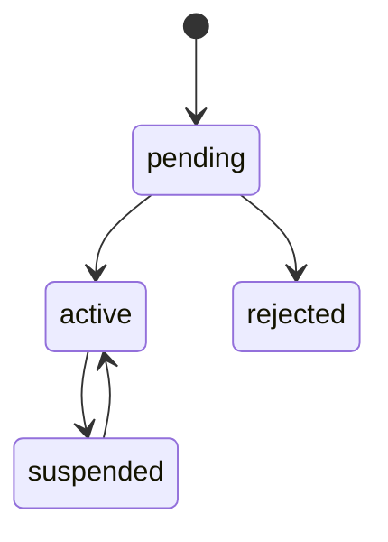

# Authentication and Authorization

## Identity Model

LINKS uses:

- Gmail/email for login and invitations
- USN as the primary student identity key
- Scoped role assignments for permissions

USN should be unique and normalized to uppercase.

## User Statuses



Rules:

- `pending` users cannot access protected resources.
- `suspended` users cannot log in or refresh tokens.
- `rejected` users need admin/HOD intervention to retry.

## Passwords

- Prefer Argon2id for new password hashes.
- Bcrypt is acceptable if simpler to operate initially.
- Never store plaintext passwords.
- Never log passwords.
- Enforce minimum password strength.

## Token Strategy

Use short-lived access tokens and rotating refresh tokens.

Recommended:

- Access token lifetime: 10-15 minutes
- Refresh token lifetime: 7-30 days
- Store refresh tokens hashed
- Rotate refresh tokens on every refresh
- Revoke tokens on logout, password reset, suspension, or role risk event

**Account Activation Token (first-time setup):**

- Single-use, emailed via magic link to the user's Gmail
- Lifetime: 7 days
- Stored as `token_hash` (bcrypt/argon2) in `account_activation_tokens` table
- On activation: verify hash, mark `used_at`, hash user's chosen password, flip `users.status` from `pending` to `active`
- Same hashing pattern as refresh tokens
- Resend endpoint rate-limited (max 1 request per 5 minutes per email)

### Activation Token Details

- **Purpose:** First-time account setup for both entry paths (admin CSV import + student self-service access request)
- **Entry paths converge here:** 
  - Path A: Admin/HOD bulk CSV import for users on college Gmail/USN list
  - Path B: Student self-service access request reviewed by HOD/Admin per ADR-004
- Both paths create `users` row with `status = 'pending'`, then issue activation token
- Token format: opaque random string (e.g., 32 bytes base64url), NOT a JWT
- Hashing: bcrypt cost 12 (matching refresh token approach)
- Index: `idx_activation_tokens_user (user_id, expires_at)` for cleanup queries
- Expiry cleanup: Periodic job or opportunistic on resend attempt

JWT rules:

- Pin signing algorithm.
- Include issuer, audience, subject, issued-at, expiry, and token ID.
- Reject tokens for inactive users.

## Cookie Strategy

For web:

- Store refresh token in `HttpOnly`, `Secure`, `SameSite=Lax` cookie.
- Prefer `__Host-` cookie prefix.
- Keep access token short-lived.
- Clear refresh cookie on logout.
- Protect state-changing endpoints from CSRF.

Avoid long-lived tokens in local storage.

## Roles

Base roles:

- `student`
- `student_coordinator`
- `faculty`
- `hod`
- `placement_officer`
- `principal`
- `alumni`
- `club_organizer`
- `admin`

Use scoped role assignments instead of only one flat role field.

Example:

```text
user_id: 123
role: student_coordinator
scope_type: department
scope_id: EC
```

## Authorization Rules

Authorization must happen in service/policy layer, not just middleware.

Examples:

- EC HOD can approve EC branch events.
- EC HOD cannot approve CSE events.
- Placement officer can see applicant data.
- Student can see only their own application details.
- Principal and admin can see college-wide summaries.

## Permission Summary

| Action | Student | Coordinator | Faculty | HOD | Placement Officer | Principal | Admin |
|---|---:|---:|---:|---:|---:|---:|---:|
| View public profiles | Yes | Yes | Yes | Yes | Yes | Yes | Yes |
| Edit own profile | Yes | Yes | Yes | Yes | Yes | Yes | Yes |
| View targeted notices | Yes | Yes | Yes | Yes | Yes | Yes | Yes |
| Post targeted announcement | No | Limited | Limited | Yes | Placement only | Yes | Yes |
| Propose event | No | Yes | Yes | Yes | Training only | Yes | Yes |
| Review branch event | No | No | Mentor only | Yes | No | Yes | Yes |
| Final event approval | No | No | No | No | No | Yes | Yes |
| Post placement opportunity | No | No | No | No | Yes | Yes | Yes |
| View applicant data | Own only | No | No | Department summary | Yes | Yes | Yes |
| Shortlist applicants | No | No | No | View only | Yes | Yes | Yes |
| Manage users and roles | No | No | No | Limited | No | Limited | Yes |

