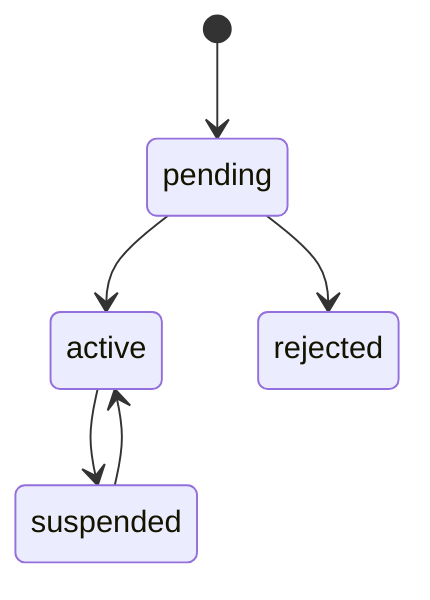

# Authentication and Authorization

## Identity Model

LINKS uses:

- Gmail/email for login and invitations
- USN as the primary student identity key
- Scoped role assignments for permissions

USN should be unique and normalized to uppercase.

## User Statuses


```mermaid
stateDiagram-v2
    [*] --> pending
    pending --> active
    pending --> rejected
    active --> suspended
    suspended --> active
```

Rules:

- `pending` users cannot access protected resources.
- `suspended` users cannot log in or refresh tokens.
- `rejected` users need admin/HOD intervention to retry.

## Passwords

- Prefer Argon2id for new password hashes.
- Bcrypt is acceptable if simpler to operate initially.
- Never store plaintext passwords.
- Never log passwords.
- Enforce minimum password strength.

## Token Strategy

Use short-lived access tokens and rotating refresh tokens.

Recommended:

- Access token lifetime: 10-15 minutes
- Refresh token lifetime: 7-30 days
- Store refresh tokens hashed
- Rotate refresh tokens on every refresh
- Revoke tokens on logout, password reset, suspension, or role risk event

**Account Activation Token (first-time setup):**

- Single-use, emailed via magic link to the user's Gmail
- Lifetime: 7 days
- Token format: 32 bytes `crypto/rand`, `base64.RawURLEncoding` (NOT a JWT, not UUIDv4)
- Stored as `token_hash` = `SHA-256(token)` in `account_activation_tokens` table
- On activation (single transaction): verify SHA-256 hash, hash user's chosen password (Argon2id/bcrypt), update `users.password_hash` and flip `users.status` to `active`, mark token `used_at`, check affected rows
- Resend endpoint: transactionally revoke or mark all prior unused activation tokens before issuing a new one. Rate-limited: query `account_activation_tokens` by `user_id` ordered by `created_at desc`, reject if last token < 5 minutes old. Activation validation accepts only the latest non-revoked token.

**Important — Hashing choice for tokens vs passwords:**

- **Passwords:** Argon2id (preferred) or bcrypt — slow, memory-hard, salted.
- **Account activation tokens & Refresh tokens:** SHA-256 — fast, deterministic. Tokens are high-entropy random strings (32 bytes), so a fast hash is sufficient and avoids DoS risk on verification endpoints.

JWT rules:

- Pin signing algorithm.
- Include issuer, audience, subject, issued-at, expiry, and token ID.
- Reject tokens for inactive users.

**Email code (sign-in, spec #129):**

- A 6-digit code from `crypto/rand`, emailed through Resend with "never share
  this code". It works once, for 10 minutes, and only with the challenge ID
  the requesting browser got back.
- Stored only as `HMAC-SHA256(server secret, challenge ID + code)`, in
  `sign_in_codes`. A 6-digit code has too little entropy for a plain hash.
- 5 wrong tries kill the code. At most 3 requests per email and 60 per IP
  address in 15 minutes, counted in the database so every serverless
  instance sees them. Emails and IPs are stored as keyed hashes.
- The reply is the same for every email, and padded to at least a second.
- Only active members who are not the principal or an admin get a code;
  the principal and admins sign in with Google only (ADR 0026). The account
  is checked again when the code is entered.
- On Vercel the client's address comes from `X-Real-IP`, which Vercel sets
  itself; elsewhere the connection's address is used, since a header could
  be forged.

**Google sign-in (spec #129):**

- The ID token is verified with `google.golang.org/api/idtoken`: signature
  against Google's published keys, audience `GOOGLE_CLIENT_ID`, expiry; then
  the issuer (`accounts.google.com`) and `email_verified`. Never an email the
  browser sends on its own.
- A nonce from `GET /auth/google/nonce`, kept in an httpOnly cookie, must
  match the token's nonce, so a token obtained in another browser can't sign
  this one in (login CSRF). The cookie is cleared on every try.
- Google's permanent account ID (`sub`) is stored on the first sign-in, which
  matches by verified email, and matched on from then on. A member already
  linked to one Google account can't be taken by another with the same email.
- An email on no list gets `403 NOT_ON_LIST` and no account. Google's tokens
  are not stored.
- The principal and admins sign in with Google only: they get no email code.
  Password login still works for everyone until #136 removes it.

## Cookie Strategy

For web:

- Store refresh token in `HttpOnly`, `Secure`, `SameSite=Lax` cookie.
- Prefer `__Host-` cookie prefix.
- Keep access token short-lived.
- Clear refresh cookie on logout.
- Protect state-changing endpoints from CSRF.

What LINKS does (ADR 0022):

- The cookie is `HttpOnly` and `SameSite=Lax` (or `Strict`). The API refuses
  to start with `COOKIE_SAME_SITE=none`, or without `COOKIE_SECURE=true`
  outside `APP_ENV=local`.
- `/auth/refresh` and `/auth/logout`, the only endpoints that read the cookie,
  check `Origin` (or `Referer`) against `FRONTEND_URL`, `CORS_ALLOWED_ORIGINS`
  and the API's own host, and return `403` for anything else.

Avoid long-lived tokens in local storage.

## Roles

Base roles:

- `student`
- `student_coordinator`
- `faculty`
- `hod`
- `placement_officer`
- `principal`
- `alumni`
- `club_organizer`
- `admin`

Use scoped role assignments instead of only one flat role field.

Example:

```text
user_id: 123
role: student_coordinator
scope_type: department
scope_id: EC
```

## When Role Changes Take Effect

Access tokens carry the user's roles and live 15 minutes, so a role change
reaches the middleware permission checks (`AuthorizeActor`) only when the user
gets a new access token:

- Ending a Role assignment, suspending or rejecting a user revokes all their
  refresh tokens in the same transaction. Their next refresh fails and they
  must sign in again, which reads their roles fresh.
- Until then, an access token issued before the change keeps working for up
  to 15 minutes with the old roles.
- Checks that matter most already re-read roles from the database instead of
  the token: Announcement publishing authority and approval (ADR 0017), and
  granting or ending the admin role. A newly granted role shows up at the
  user's next sign-in or refresh.

## Authorization Rules

Authorization must happen in service/policy layer, not just middleware.

Examples:

- EC HOD can approve EC branch events.
- EC HOD cannot approve CSE events.
- Placement officer can see applicant data.
- Student can see only their own application details.
- Principal and admin can see college-wide summaries.

## Permission Summary

| Action | Student | Coordinator | Faculty | HOD | Placement Officer | Principal | Admin |
|---|---:|---:|---:|---:|---:|---:|---:|
| View public profiles | Yes | Yes | Yes | Yes | Yes | Yes | Yes |
| Edit own profile | Yes | Yes | Yes | Yes | Yes | Yes | Yes |
| View targeted notices | Yes | Yes | Yes | Yes | Yes | Yes | Yes |
| Post targeted announcement | No | Limited | Limited | Yes | Placement only | Yes | Yes |
| Propose event | No | Yes | Yes | Yes | Training only | Yes | Yes |
| Review branch event | No | No | Mentor only | Yes | No | Yes | Yes |
| Final event approval | No | No | No | No | No | Yes | Yes |
| Post placement opportunity | No | No | No | No | Yes | Yes | Yes |
| View applicant data | Own only | No | No | Department summary | Yes | Yes | Yes |
| Shortlist applicants | No | No | No | View only | Yes | Yes | Yes |
| Decide access requests | No | No | No | Own Department | No | Yes | Yes |
| Manage users and roles | No | No | No | Limited | No | Limited | Yes |

Importing students from a CSV (`import_students`) is open to admins, the
principal and HODs; an HOD can import only students whose USN is in their own
Department.

"Manage users and roles" for the principal means everything but the `admin`
role, which only an admin grants or ends. HODs don't manage users or roles;
they decide Access requests (`approve_access`) for their own Department only
(ADR 0025): approve, or reject with a note. Suspending and reactivating
accounts stay with the principal and admins.

