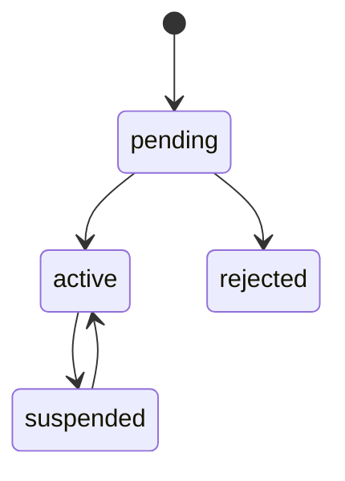

# Authentication and Authorization

## Identity Model

LINKS uses:

- Gmail/email for login and invitations
- USN as the primary student identity key
- Scoped role assignments for permissions

USN should be unique and normalized to uppercase.

## User Statuses


```mermaid
stateDiagram-v2
    [*] --> pending
    pending --> active
    pending --> rejected
    active --> suspended
    suspended --> active
```

Rules:

- `pending` users cannot access protected resources.
- `suspended` users cannot log in or refresh tokens.
- `rejected` users need admin/HOD intervention to retry.

## Token Strategy

Use short-lived access tokens and rotating refresh tokens.

Recommended:

- Access token lifetime: 10-15 minutes
- Refresh token lifetime: 7-30 days
- Store refresh tokens hashed
- Rotate refresh tokens on every refresh
- Revoke tokens on logout, suspension, or role risk event

Refresh tokens are high-entropy random strings (32 bytes), stored as
`SHA-256` hashes: a fast hash is enough for that and avoids DoS risk on the
refresh endpoint. There are no passwords to hash (ADR 0026).

JWT rules:

- Pin signing algorithm.
- Include issuer, audience, subject, issued-at, expiry, and token ID.
- Reject tokens for inactive users.

**Email code (sign-in, spec #129):**

- A 6-digit code from `crypto/rand`, emailed through Resend with "never share
  this code". It works once, for 10 minutes, and only with the challenge ID
  the requesting browser got back.
- Stored only as `HMAC-SHA256(server secret, challenge ID + code)`, in
  `sign_in_codes`. A 6-digit code has too little entropy for a plain hash.
- 5 wrong tries kill the code. At most 3 requests per email and 60 per IP
  address in 15 minutes, counted in the database so every serverless
  instance sees them, and at most 10 requests per email in a day. Emails and
  IPs are stored as keyed hashes.
- After 10 wrong guesses at an email's codes within a day, that email gets
  no new code for the rest of the day (the reply still looks the same). This
  stops someone guessing by asking for code after code: without it, about
  1,400 guesses a day would find a 6-digit code within a year.
- The reply is the same for every email, and padded to at least a second.
- Any email gets a code except the principal's, an admin's (Google only,
  ADR 0026) or a suspended or rejected account's. An email on no list gets
  one too, so its owner can prove it and send an Access request. At most 50
  codes a day go to emails on no list across the whole site; past that they
  get the usual reply and no code, so LINKS can't be used to flood inboxes
  or use up the email quota. Members are never caught by this cap. The
  account is checked again when the code is entered.
- On Vercel the client's address comes from `X-Real-IP`, which Vercel sets
  itself; elsewhere the connection's address is used, since a header could
  be forged.

**Google sign-in (spec #129):**

- The ID token is verified with `google.golang.org/api/idtoken`: signature
  against Google's published keys, audience `GOOGLE_CLIENT_ID`, expiry; then
  the issuer (`accounts.google.com`) and `email_verified`. Never an email the
  browser sends on its own.
- A nonce from `GET /auth/google/nonce`, kept in an httpOnly cookie, must
  match the token's nonce, so a token obtained in another browser can't sign
  this one in (login CSRF). The cookie is cleared on every try.
- Google's permanent account ID (`sub`) is stored on the first sign-in, which
  matches by verified email, and matched on from then on. A member already
  linked to one Google account can't be taken by another with the same email.
- An email on no list gets `403 NOT_ON_LIST` and no account. Google's tokens
  are not stored.
- The principal and admins sign in with Google only: they get no email code.

**First sign-in (spec #129, #133):**

- An imported row, a staff invite or an approved Access request is an
  account waiting for its first sign-in (`pending` and verified). No email
  is sent. Signing in with its email, by Google or a code, makes it `active`
  and returns who it is, so the screen can ask "Not you?".
- "Not you?" (`POST /auth/not-me`), within an hour of the first sign-in,
  revokes every refresh token, unlinks any Google account and sends the
  account back to the review queue. Nobody can sign into it until an admin
  or HOD approves it again, so the person who reported it can't land back in
  the wrong row.
- An email on no list gets `NOT_ON_LIST` with a request token: an HS256 JWT
  for the proven email, with its own key derived from the server secret and
  its own audience, valid 30 minutes. It sends one Access request with a USN
  and name (`POST /auth/access-request`), no password.
- Every first sign-in, "Not you?" and invite is audited.

## Cookie Strategy

For web:

- Store refresh token in `HttpOnly`, `Secure`, `SameSite=Lax` cookie.
- Prefer `__Host-` cookie prefix.
- Keep access token short-lived.
- Clear refresh cookie on logout.
- Protect state-changing endpoints from CSRF.

What LINKS does (ADR 0022):

- The cookie is `HttpOnly` and `SameSite=Lax` (or `Strict`). The API refuses
  to start with `COOKIE_SAME_SITE=none`, or without `COOKIE_SECURE=true`
  outside `APP_ENV=local`.
- `/auth/refresh` and `/auth/logout`, the only endpoints that read the cookie,
  check `Origin` (or `Referer`) against `FRONTEND_URL`, `CORS_ALLOWED_ORIGINS`
  and the API's own host, and return `403` for anything else.

Avoid long-lived tokens in local storage.

## Roles

Base roles:

- `student`
- `student_coordinator`
- `faculty`
- `hod`
- `placement_officer`
- `principal`
- `alumni`
- `club_organizer`
- `admin`

Use scoped role assignments instead of only one flat role field.

Example:

```text
user_id: 123
role: student_coordinator
scope_type: department
scope_id: EC
```

## When Role Changes Take Effect

Access tokens carry the user's roles and live 15 minutes, so a role change
reaches the middleware permission checks (`AuthorizeActor`) only when the user
gets a new access token:

- Ending a Role assignment also withdraws or hands over the work the person
  can no longer author, in the same transaction (ADR 0028).
- Ending a Role assignment, suspending or rejecting a user revokes all their
  refresh tokens in the same transaction. Their next refresh fails and they
  must sign in again, which reads their roles fresh.
- Until then, an access token issued before the change keeps working for up
  to 15 minutes with the old roles. Suspending or rejecting an account takes
  effect at once, though: every request reads the account's status, and a
  suspended or rejected account gets `401` (#175).
- Checks that matter most already re-read roles from the database instead of
  the token: Announcement publishing authority and approval (ADR 0017), and
  granting or ending the admin role. A newly granted role shows up at the
  user's next sign-in or refresh.

## Authorization Rules

Authorization must happen in service/policy layer, not just middleware.

Examples:

- EC HOD can approve EC branch events.
- EC HOD cannot approve CSE events.
- Placement officer can see applicant data.
- Student can see only their own application details.
- Principal and admin can see college-wide summaries.

## Permission Summary

| Action | Student | Coordinator | Faculty | HOD | Placement Officer | Principal | Admin |
|---|---:|---:|---:|---:|---:|---:|---:|
| View public profiles | Yes | Yes | Yes | Yes | Yes | Yes | Yes |
| Edit own profile | Yes | Yes | Yes | Yes | Yes | Yes | Yes |
| View targeted notices | Yes | Yes | Yes | Yes | Yes | Yes | Yes |
| Post targeted announcement | No | Limited | Limited | Yes | Placement only | Yes | Yes |
| Propose event | No | Yes | Yes | Yes | Training only | Yes | Yes |
| Review branch event | No | No | Mentor only | Yes | No | Yes | Yes |
| Final event approval | No | No | No | No | No | Yes | Yes |
| Post placement opportunity | No | No | No | No | Yes | Yes | Yes |
| View applicant data | Own only | No | No | Department summary | Yes | Yes | Yes |
| Shortlist applicants | No | No | No | View only | Yes | Yes | Yes |
| Decide access requests | No | No | No | Own Department | No | Yes | Yes |
| Import students | No | No | No | Own Department | No | No | Yes |
| Add staff (staff invite) | No | No | No | Faculty, own Department | No | No | Yes |
| Manage users and roles | No | No | No | Limited | No | Limited | Yes |

Importing students from a CSV (`import_students`) is open to admins and HODs;
an HOD can import only students whose USN is in their own Department. Staff
invites (`invite_staff`) are open to admins, for any role, and HODs, for
faculty of their own Department. The principal does neither (ADR 0029), and
being the principal doesn't widen an HOD's own Department scope.

Role management is split by who normally appoints each role (ADR 0027): an
HOD grants and ends `student_coordinator` for students of their own
Department, the principal grants and ends `faculty`, `hod` and
`placement_officer`, and an admin grants and ends every role, including
`principal` and `admin`. Beyond appointing coordinators and adding faculty, HODs don't manage
users; they decide Access requests (`approve_access`) for their own Department only
(ADR 0025): approve, or reject with a note. Suspending and reactivating
accounts stay with the principal and admins.

