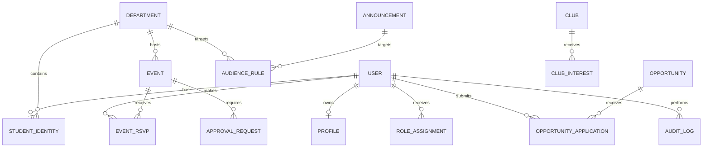

# Database Design

## Database Choice

Use PostgreSQL as the source of truth.

Reasons:

- Strong relational model
- Transactions
- Foreign keys and constraints
- JSONB for eligibility rules
- Good indexing and reporting support

## Design Rules

- Use UUID primary keys for public-facing entities.
- Use explicit SQL migrations.
- Avoid GORM auto-migration in production.
- Use foreign keys for important relationships.
- Use check constraints for statuses.
- Use `timestamptz`.
- Use unique indexes for USN, email, slugs, and application uniqueness.
- Use soft delete only where recovery is required.

## Entity Relationship Overview



## Core Tables

### users

```sql
users (
  id uuid primary key,
  email text unique,
  phone text,
  password_hash text not null,
  status text not null,
  is_verified boolean not null default false,
  created_by uuid references users(id),
  created_at timestamptz not null,
  updated_at timestamptz not null
)
```

### student_identities

```sql
student_identities (
  user_id uuid primary key references users(id),
  usn text unique not null,
  department_id uuid references departments(id),
  batch_year int not null,
  admission_year int,
  roll_number text,
  created_at timestamptz not null,
  updated_at timestamptz not null
)
```

USN should be normalized to uppercase before storage.

### profiles

```sql
profiles (
  user_id uuid primary key references users(id),
  full_name text not null,
  headline text,
  bio text,
  avatar_url text,
  public_profile_enabled boolean not null default true,
  show_email boolean not null default false,
  show_phone boolean not null default false,
  linkedin_url text,
  github_url text,
  portfolio_url text,
  created_at timestamptz not null,
  updated_at timestamptz not null
)
```

### departments

```sql
departments (
  id uuid primary key,
  code text unique not null,
  name text not null,
  description text,
  hod_user_id uuid references users(id),
  created_at timestamptz not null,
  updated_at timestamptz not null
)
```

### role_assignments

```sql
role_assignments (
  id uuid primary key,
  user_id uuid not null references users(id),
  role text not null,
  scope_type text not null,
  scope_id uuid,
  assigned_by uuid references users(id),
  starts_at timestamptz not null,
  ends_at timestamptz,
  created_at timestamptz not null
)
```

### announcements

```sql
announcements (
  id uuid primary key,
  title text not null,
  body text not null,
  publisher_id uuid not null references users(id),
  status text not null,
  visibility text not null,
  published_at timestamptz,
  expires_at timestamptz,
  created_at timestamptz not null,
  updated_at timestamptz not null
)
```

### audience_rules

```sql
audience_rules (
  id uuid primary key,
  target_type text not null,
  target_id uuid not null,
  department_id uuid references departments(id),
  batch_year int,
  role text,
  club_id uuid,
  eligibility jsonb,
  created_at timestamptz not null
)
```

### events

```sql
events (
  id uuid primary key,
  title text not null,
  description text,
  event_type text not null,
  organizer_type text not null,
  organizer_id uuid not null,
  department_id uuid references departments(id),
  club_id uuid,
  faculty_mentor_id uuid references users(id),
  location text,
  starts_at timestamptz not null,
  ends_at timestamptz not null,
  banner_url text,
  status text not null,
  approval_status text not null,
  submitted_by uuid references users(id),
  hod_approved_by uuid references users(id),
  final_approved_by uuid references users(id),
  final_approved_at timestamptz,
  rejection_reason text,
  created_at timestamptz not null,
  updated_at timestamptz not null
)
```

### event_rsvps

```sql
event_rsvps (
  id uuid primary key,
  event_id uuid not null references events(id),
  user_id uuid not null references users(id),
  status text not null,
  created_at timestamptz not null,
  updated_at timestamptz not null,
  unique (event_id, user_id)
)
```

### opportunities

```sql
opportunities (
  id uuid primary key,
  title text not null,
  description text not null,
  opportunity_type text not null,
  company_or_source text,
  location text,
  eligibility jsonb not null,
  application_mode text not null,
  application_url text,
  deadline timestamptz,
  posted_by uuid not null references users(id),
  status text not null,
  created_at timestamptz not null,
  updated_at timestamptz not null
)
```

### opportunity_applications

```sql
opportunity_applications (
  id uuid primary key,
  opportunity_id uuid not null references opportunities(id),
  student_id uuid not null references users(id),
  status text not null,
  application_mode text not null,
  external_application_url text,
  external_application_confirmed_at timestamptz,
  applied_at timestamptz,
  shortlisted_at timestamptz,
  selected_at timestamptz,
  notes text,
  created_at timestamptz not null,
  updated_at timestamptz not null,
  unique (opportunity_id, student_id)
)
```

### approval_requests

```sql
approval_requests (
  id uuid primary key,
  request_type text not null,
  target_id uuid not null,
  submitted_by uuid not null references users(id),
  reviewer_id uuid references users(id),
  department_id uuid references departments(id),
  status text not null,
  note text,
  decided_at timestamptz,
  created_at timestamptz not null,
  updated_at timestamptz not null
)
```

### audit_logs

```sql
audit_logs (
  id uuid primary key,
  actor_id uuid references users(id),
  action text not null,
  resource_type text not null,
  resource_id uuid,
  metadata jsonb,
  ip_address text,
  user_agent text,
  created_at timestamptz not null
)
```

## Important Indexes

```sql
create unique index idx_student_identities_usn on student_identities (lower(usn));
create unique index idx_users_email on users (lower(email)) where email is not null;
create index idx_users_status on users (status);
create index idx_role_assignments_user on role_assignments (user_id);
create index idx_role_assignments_role_scope on role_assignments (role, scope_type, scope_id);
create index idx_announcements_status_published on announcements (status, published_at desc);
create index idx_audience_rules_target on audience_rules (target_type, target_id);
create index idx_events_department_starts on events (department_id, starts_at);
create index idx_events_approval_status on events (approval_status);
create index idx_event_rsvps_event on event_rsvps (event_id);
create index idx_opportunities_status_deadline on opportunities (status, deadline);
create index idx_opportunity_applications_opportunity on opportunity_applications (opportunity_id, status);
create index idx_opportunity_applications_student on opportunity_applications (student_id, status);
create index idx_audit_logs_resource on audit_logs (resource_type, resource_id, created_at desc);
```

## Connection Pool Defaults

Start conservative:

```text
MaxOpenConns: 10-25
MaxIdleConns: 5-10
ConnMaxLifetime: 30-60 minutes
ConnMaxIdleTime: 5-10 minutes
```

