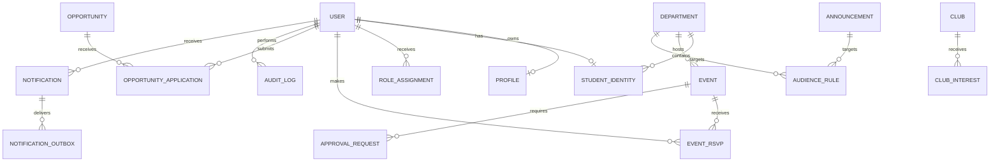

# Database Design

## Database Choice

Use PostgreSQL as the source of truth.

Reasons:

- Strong relational model
- Transactions
- Foreign keys and constraints
- JSONB for eligibility rules
- Good indexing and reporting support

## Design Rules

- Use UUID primary keys for public-facing entities.
- Use explicit SQL migrations.
- Avoid GORM auto-migration in production.
- Use foreign keys for important relationships.
- Use check constraints for statuses.
- Use `timestamptz`.
- Use unique indexes for USN, email, slugs, and application uniqueness.
- Use soft delete only where recovery is required.

## Entity Relationship Overview



## Core Tables

### users

```sql
users (
  id uuid primary key,
  email text unique,
  phone text,
  password_hash text not null,
  status text not null,
  is_verified boolean not null default false,
  created_by uuid references users(id),
  created_at timestamptz not null,
  updated_at timestamptz not null
)
```

### account_activation_tokens

```sql
account_activation_tokens (
  id uuid primary key,
  user_id uuid not null references users(id),
  token_hash text not null,
  purpose text not null default 'activate',
  expires_at timestamptz not null,
  used_at timestamptz,
  created_at timestamptz not null
)
```

```sql
create index idx_activation_tokens_user on account_activation_tokens (user_id, expires_at);
```

`token_hash` = `SHA-256(token)` (fast hash, not bcrypt/argon2). The token is a 32-byte `crypto/rand` value, `base64.RawURLEncoding`. On activation: server computes `SHA-256(presented_token)`, compares to `token_hash`, marks `used_at`, hashes user's chosen password with Argon2id/bcrypt, flips `users.status` from `pending` to `active`. Resend rate-limit uses this table: query by `user_id` order by `created_at desc`, reject if last token < 5 min old. No separate rate-limit table or Redis needed.

### student_identities

```sql
student_identities (
  user_id uuid primary key references users(id),
  usn text unique not null,
  department_id uuid references departments(id),
  batch_year int not null,
  admission_year int,
  roll_number text,
  created_at timestamptz not null,
  updated_at timestamptz not null
)
```

USN should be normalized to uppercase before storage.

### profiles

```sql
profiles (
  user_id uuid primary key references users(id),
  username text unique not null,
  full_name text not null,
  headline text,
  bio text,
  avatar_url text,
  public_profile_enabled boolean not null default true,
  show_email boolean not null default false,
  show_phone boolean not null default false,
  linkedin_url text,
  github_url text,
  portfolio_url text,
  created_at timestamptz not null,
  updated_at timestamptz not null
)
```

`username` is an immutable, lowercase public handle used by `GET /api/v1/profiles/:username`.

### departments

```sql
departments (
  id uuid primary key,
  code text unique not null,
  name text not null,
  description text,
  hod_user_id uuid references users(id),
  created_at timestamptz not null,
  updated_at timestamptz not null
)
```

### role_assignments

```sql
role_assignments (
  id uuid primary key,
  user_id uuid not null references users(id),
  role text not null,
  scope_type text not null,
  scope_id uuid,
  assigned_by uuid references users(id),
  starts_at timestamptz not null,
  ends_at timestamptz,
  created_at timestamptz not null
)
```

### announcements

```sql
announcements (
  id uuid primary key,
  title text not null,
  body text not null,
  publisher_id uuid not null references users(id),
  status text not null,
  visibility text not null,
  published_at timestamptz,
  expires_at timestamptz,
  created_at timestamptz not null,
  updated_at timestamptz not null
)
```

### audience_rules

```sql
audience_rules (
  id uuid primary key,
  target_type text not null,
  target_id uuid not null,
  department_id uuid references departments(id),
  batch_year int,
  role text,
  club_id uuid,
  eligibility jsonb,
  created_at timestamptz not null
)
```

### events

```sql
events (
  id uuid primary key,
  title text not null,
  description text,
  event_type text not null,
  organizer_type text not null,
  organizer_id uuid not null,
  department_id uuid references departments(id),
  club_id uuid,
  faculty_mentor_id uuid references users(id),
  location text,
  starts_at timestamptz not null,
  ends_at timestamptz not null,
  banner_url text,
  status text not null,
  approval_status text not null,
  submitted_by uuid references users(id),
  hod_approved_by uuid references users(id),
  final_approved_by uuid references users(id),
  final_approved_at timestamptz,
  rejection_reason text,
  created_at timestamptz not null,
  updated_at timestamptz not null
)
```

### event_rsvps

```sql
event_rsvps (
  id uuid primary key,
  event_id uuid not null references events(id),
  user_id uuid not null references users(id),
  status text not null,
  created_at timestamptz not null,
  updated_at timestamptz not null,
  unique (event_id, user_id)
)
```

### opportunities

```sql
opportunities (
  id uuid primary key,
  title text not null,
  description text not null,
  opportunity_type text not null,
  company_or_source text,
  location text,
  eligibility jsonb not null,
  application_mode text not null,
  application_url text,
  deadline timestamptz,
  posted_by uuid not null references users(id),
  status text not null,
  created_at timestamptz not null,
  updated_at timestamptz not null
)
```

### opportunity_applications

```sql
opportunity_applications (
  id uuid primary key,
  opportunity_id uuid not null references opportunities(id),
  student_id uuid not null references users(id),
  status text not null,
  application_mode text not null,
  external_application_url text,
  external_application_confirmed_at timestamptz,
  applied_at timestamptz,
  shortlisted_at timestamptz,
  selected_at timestamptz,
  notes text,
  created_at timestamptz not null,
  updated_at timestamptz not null,
  unique (opportunity_id, student_id)
)
```

### approval_requests

```sql
approval_requests (
  id uuid primary key,
  request_type text not null,
  target_id uuid not null,
  submitted_by uuid not null references users(id),
  reviewer_id uuid references users(id),
  department_id uuid references departments(id),
  status text not null,
  note text,
  decided_at timestamptz,
  created_at timestamptz not null,
  updated_at timestamptz not null
)
```

### audit_logs

```sql
audit_logs (
  id uuid primary key,
  actor_id uuid references users(id),
  action text not null,
  resource_type text not null,
  resource_id uuid,
  metadata jsonb,
  ip_address text,
  user_agent text,
  created_at timestamptz not null
)
```

### notifications

```sql
notifications (
  id uuid primary key,
  user_id uuid not null references users(id),
  type text not null,
  priority text not null,
  title text not null,
  body text not null,
  action_url text,
  resource_type text,
  resource_id uuid,
  read_at timestamptz,
  created_at timestamptz not null
)
```

### notification_outbox

```sql
notification_outbox (
  id uuid primary key,
  notification_id uuid references notifications(id),
  channel text not null,
  status text not null,
  attempts int not null default 0,
  next_attempt_at timestamptz,
  last_error text,
  created_at timestamptz not null,
  updated_at timestamptz not null
)
```

### notification_preferences

```sql
notification_preferences (
  user_id uuid primary key references users(id),
  email_enabled boolean not null default true,
  push_enabled boolean not null default false,
  placement_alerts boolean not null default true,
  event_alerts boolean not null default true,
  announcement_alerts boolean not null default true,
  digest_enabled boolean not null default false,
  updated_at timestamptz not null
)
```

### saved_opportunities

```sql
saved_opportunities (
  user_id uuid not null references users(id),
  opportunity_id uuid not null references opportunities(id),
  created_at timestamptz not null,
  primary key (user_id, opportunity_id)
)
```

### saved_events

```sql
saved_events (
  user_id uuid not null references users(id),
  event_id uuid not null references events(id),
  created_at timestamptz not null,
  primary key (user_id, event_id)
)
```

### push_subscriptions

```sql
push_subscriptions (
  id uuid primary key,
  user_id uuid not null references users(id),
  endpoint text not null,
  p256dh_key text not null,
  auth_key text not null,
  user_agent text,
  is_active boolean not null default true,
  created_at timestamptz not null,
  updated_at timestamptz not null,
  unique (user_id, endpoint)
)
```

### clubs

```sql
clubs (
  id uuid primary key,
  slug text unique not null,
  name text not null,
  description text,
  department_id uuid references departments(id),
  coordinator_user_id uuid references users(id),
  faculty_advisor_id uuid references users(id),
  logo_url text,
  status text not null,
  created_by uuid references users(id),
  created_at timestamptz not null,
  updated_at timestamptz not null
)
```

Slug should be normalized to lowercase before storage. `status` is constrained to
known values (for example `active`, `inactive`) with a check constraint.

### club_interests

```sql
club_interests (
  id uuid primary key,
  club_id uuid not null references clubs(id),
  user_id uuid not null references users(id),
  message text,
  status text not null,
  decided_by uuid references users(id),
  decided_at timestamptz,
  created_at timestamptz not null,
  updated_at timestamptz not null,
  unique (club_id, user_id)
)
```

`status` tracks the join-interest lifecycle (for example `pending`, `accepted`,
`rejected`, `withdrawn`) with a check constraint. One active interest per user per club
is enforced by the unique index.

### alumni_profiles

```sql
alumni_profiles (
  user_id uuid primary key references users(id),
  usn text,
  department_id uuid references departments(id),
  graduation_year int not null,
  current_company text,
  current_role text,
  current_location text,
  is_mentor_available boolean not null default false,
  verification_status text not null,
  verified_by uuid references users(id),
  verified_at timestamptz,
  created_at timestamptz not null,
  updated_at timestamptz not null
)
```

USN should be normalized to uppercase before storage when present. Per ADR-007 and the
plan, alumni verification uses USN first and falls back to admin verification, captured
by `verification_status` (for example `pending`, `verified`, `rejected`).

### mentorship_requests

```sql
mentorship_requests (
  id uuid primary key,
  student_id uuid not null references users(id),
  mentor_id uuid not null references users(id),
  topic text,
  message text,
  status text not null,
  responded_at timestamptz,
  response_note text,
  created_at timestamptz not null,
  updated_at timestamptz not null
)
```

`mentor_id` references the mentoring user (an alumni account with
`alumni_profiles.is_mentor_available = true`). `status` follows the request lifecycle
(for example `pending`, `accepted`, `declined`, `completed`, `cancelled`) with a check
constraint.

## Important Indexes

```sql
create unique index idx_student_identities_usn on student_identities (lower(usn));
create unique index idx_users_email on users (lower(email)) where email is not null;
create index idx_users_status on users (status);
create index idx_role_assignments_user on role_assignments (user_id);
create index idx_role_assignments_role_scope on role_assignments (role, scope_type, scope_id);
create index idx_announcements_status_published on announcements (status, published_at desc);
create index idx_audience_rules_target on audience_rules (target_type, target_id);
create index idx_events_department_starts on events (department_id, starts_at);
create index idx_events_approval_status on events (approval_status);
create index idx_event_rsvps_event on event_rsvps (event_id);
create index idx_opportunities_status_deadline on opportunities (status, deadline);
create index idx_opportunity_applications_opportunity on opportunity_applications (opportunity_id, status);
create index idx_opportunity_applications_student on opportunity_applications (student_id, status);
create index idx_audit_logs_resource on audit_logs (resource_type, resource_id, created_at desc);
create index idx_notifications_user_created on notifications (user_id, created_at desc);
create index idx_notifications_user_unread on notifications (user_id, read_at) where read_at is null;
create unique index idx_profiles_username on profiles (lower(username));
create index idx_notification_outbox_status_next on notification_outbox (status, next_attempt_at);
create unique index idx_clubs_slug on clubs (lower(slug));
create index idx_clubs_department on clubs (department_id);
create index idx_club_interests_club_status on club_interests (club_id, status);
create index idx_club_interests_user on club_interests (user_id);
create unique index idx_alumni_profiles_usn on alumni_profiles (lower(usn)) where usn is not null;
create index idx_alumni_profiles_mentor on alumni_profiles (is_mentor_available) where is_mentor_available = true;
create index idx_mentorship_requests_mentor_status on mentorship_requests (mentor_id, status);
create index idx_mentorship_requests_student on mentorship_requests (student_id, status);
```

## Connection Pool Defaults

Start conservative:

```text
MaxOpenConns: 10-25
MaxIdleConns: 5-10
ConnMaxLifetime: 30-60 minutes
ConnMaxIdleTime: 5-10 minutes
```
