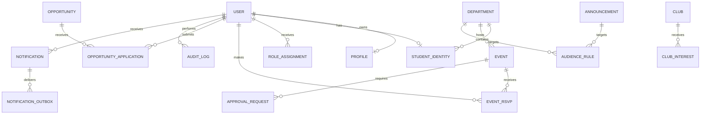

# Database Design

## Database Choice

Use PostgreSQL as the source of truth.

Reasons:

- Strong relational model
- Transactions
- Foreign keys and constraints
- JSONB for eligibility rules
- Good indexing and reporting support

## Design Rules

- Use UUID primary keys for public-facing entities.
- Use explicit SQL migrations.
- Avoid GORM auto-migration in production.
- Use foreign keys for important relationships.
- Use check constraints for statuses.
- Use `timestamptz`.
- Use unique indexes for USN, email, slugs, and application uniqueness.
- Use soft delete only where recovery is required.

## Entity Relationship Overview


```mermaid
erDiagram
    USER ||--o| PROFILE : owns
    USER ||--o| STUDENT_IDENTITY : has
    USER ||--o{ ROLE_ASSIGNMENT : receives
    USER ||--o{ EVENT_RSVP : makes
    USER ||--o{ OPPORTUNITY_APPLICATION : submits
    USER ||--o{ AUDIT_LOG : performs
    USER ||--o{ NOTIFICATION : receives

    DEPARTMENT ||--o{ STUDENT_IDENTITY : contains
    DEPARTMENT ||--o{ EVENT : hosts
    DEPARTMENT ||--o{ AUDIENCE_RULE : targets

    ANNOUNCEMENT ||--o{ AUDIENCE_RULE : targets
    EVENT ||--o{ EVENT_RSVP : receives
    EVENT ||--o{ APPROVAL_REQUEST : requires

    OPPORTUNITY ||--o{ OPPORTUNITY_APPLICATION : receives
    CLUB ||--o{ CLUB_INTEREST : receives
    NOTIFICATION ||--o{ NOTIFICATION_OUTBOX : delivers
```

## Core Tables

### users

```sql
users (
  id uuid primary key,
  email text unique,
  phone text,
  google_subject text,          -- Google's permanent account ID (sub)
  first_signed_in_at timestamptz,
  status text not null,
  is_verified boolean not null default false,
  created_by uuid references users(id),
  created_at timestamptz not null,
  updated_at timestamptz not null
)
```

An account is waiting for its first sign-in while `status = 'pending'` and
`is_verified` is true (an imported row, a staff invite, or an approved Access
request). `first_signed_in_at` is set when that first sign-in makes it
active, and cleared by "Not you?".

`google_subject` is unique where set (`idx_users_google_subject`). It is
stored on the first Google sign-in, which matches by verified email, and
matched on from then on.

### sign_in_codes

```sql
sign_in_codes (
  id uuid primary key,          -- the challenge ID the browser keeps
  email_hash text not null,
  ip_hash text not null,
  user_id uuid references users(id) on delete cascade,
  code_hash text,
  attempts int not null default 0,
  expires_at timestamptz not null,
  used_at timestamptz,
  created_at timestamptz not null default now(),
  device_id uuid references known_devices(id) on delete set null  -- migration 026
)
```

```sql
create index idx_sign_in_codes_email_created on sign_in_codes (email_hash, created_at);
create index idx_sign_in_codes_ip_created on sign_in_codes (ip_hash, created_at);
```

One row per email code request, whether or not a code was sent, so the
per-email and per-IP limits count every request alike and hold across
serverless instances (no Redis). `user_id` and `code_hash` are null when no
code was sent. The email, the IP address and the code are stored only as
HMAC-SHA256 values keyed with the server secret; the code's HMAC includes the
challenge ID. Rows older than a day are deleted on the next request.
`device_id` is set when the request came from a browser known for the account.

### known_devices

```sql
known_devices (                 -- migration 026
  id uuid primary key,
  user_id uuid not null references users(id) on delete cascade,
  token_hash text not null unique,   -- HMAC of the browser's device token
  created_at timestamptz not null,
  last_used_at timestamptz not null,
  expires_at timestamptz not null    -- 180 days after last use
)
```

A browser that signed in to an account with an email code. Its code
requests for that account count against its own allowance instead of its
network address's, so others on the same campus Wi-Fi can't use it up. An
account keeps its ten most recently used browsers.

### student_identities

```sql
student_identities (
  user_id uuid primary key references users(id),
  usn text unique not null,
  department_id uuid references departments(id),
  batch_year int not null,
  admission_year int,
  roll_number text,
  created_at timestamptz not null,
  updated_at timestamptz not null
)
```

USN should be normalized to uppercase before storage. `batch_year` is the
student's Batch: it starts as the joining year in the USN (`4MN23CS001` →
2023) and an admin can change it for a year-back student (ADR 0019).

### profiles

```sql
profiles (
  user_id uuid primary key references users(id),
  username text unique not null,
  full_name text not null,
  headline text,
  bio text,
  avatar_url text,
  public_profile_enabled boolean not null default true,
  show_email boolean not null default false,
  show_phone boolean not null default false,
  linkedin_url text,
  github_url text,
  portfolio_url text,
  created_at timestamptz not null,
  updated_at timestamptz not null
)
```

`username` is an immutable, lowercase public handle used by `GET /api/v1/profiles/:username`.

Directory search (migration 016) adds the `pg_trgm` extension in `public`,
GIN trigram indexes on `lower(full_name)`, `lower(username)` and
`lower(headline)`, and an immutable `directory_letters(text)` function that
sorts a word's letters, used to match a search word with swapped letters.

### departments

```sql
departments (
  id uuid primary key,
  code text unique not null,
  name text not null,
  description text,
  hod_user_id uuid references users(id),
  created_at timestamptz not null,
  updated_at timestamptz not null
)
```

`hod_user_id` is no longer read or written by the departments module: a
Department's HOD is the `hod` Role assignment scoped to it (#179). The column
stays until a forward-only migration drops it (ADR 0020).

### role_assignments

```sql
role_assignments (
  id uuid primary key,
  user_id uuid not null references users(id),
  role text not null,
  scope_type text not null,
  scope_id uuid,
  assigned_by uuid references users(id),
  starts_at timestamptz not null,
  ends_at timestamptz,
  created_at timestamptz not null,
  welcomed_at timestamptz         -- when the holder closed the welcome to this role
)
```

`welcomed_at` (migration 025) is set the first time the holder closes Home's
welcome to a new role, so it shows once per account on every device. Only
student coordinator roles are welcomed for now.

Ending a Role assignment sets `ends_at` and keeps the row, so the table is also
the history of who held which role. A role is in effect when
`starts_at <= now()` and `ends_at` is null or later. Role management refuses
a second assignment of the same role and Scope with an overlapping time range,
and a second HOD for a Department at the same time.

### announcements

```sql
announcements (
  id uuid primary key,
  title text not null,
  body text not null,
  category text not null,       -- official | department | placement
  publisher_id uuid not null references users(id),
  status text not null,         -- draft | pending | published | rejected | withdrawn
  published_at timestamptz,
  expires_at timestamptz,
  created_at timestamptz not null,
  updated_at timestamptz not null
)
```

### announcement_revisions

Content waiting for Announcement approval (ADR 0017): a new Announcement's first
version, or an edit to a published one. Approving a revision copies it onto the
Announcement. At most one open (draft, pending or rejected) revision per
Announcement. A `closed` revision can never go live: its Announcement was
withdrawn, or a direct edit replaced it.

```sql
announcement_revisions (
  id uuid primary key,
  announcement_id uuid not null references announcements(id),
  title text not null,
  body text not null,
  category text not null,
  audience jsonb not null,             -- audience rules as submitted
  expires_at timestamptz,
  status text not null,                -- draft | pending | approved | rejected | closed
  approver_department_id uuid,         -- that Department's HOD; null = principal/admin
  submitted_by uuid not null references users(id),
  submitted_at timestamptz,
  reviewed_by uuid references users(id),
  reviewed_at timestamptz,
  review_note text,
  created_at timestamptz not null,
  updated_at timestamptz not null
)
```

### audience_rules

An Announcement's Audience is its audience rules (`target_type = 'announcement'`),
and an Event's is `target_type = 'event'`.
Fields set in one rule must all match; matching any rule is enough; no rules
means the whole college. Visibility comes from these rules, so announcements
have no separate visibility column.

```sql
audience_rules (
  id uuid primary key,
  target_type text not null,
  target_id uuid not null,
  department_id uuid references departments(id),
  batch_year int,
  role text,
  club_id uuid,
  eligibility jsonb,
  created_at timestamptz not null
)
```

### events

One `status` column carries the whole workflow (ADR 0023): `draft`,
`submitted`, `hod_changes_requested`, `hod_rejected`, `hod_approved`,
`final_changes_requested`, `final_rejected`, `published`, `cancelled`. An
Event's Audience is its `audience_rules` with `target_type = 'event'`.

```sql
events (
  id uuid primary key,
  title text not null,
  description text not null default '',
  event_type text not null,       -- talk | workshop | competition | cultural | sports | training | other
  proposer_id uuid not null references users(id),
  organiser_id uuid not null references users(id),   -- runs it; starts as the proposer (ADR 0028)
  department_id uuid references departments(id),   -- null: college-wide
  faculty_mentor_id uuid references users(id),
  location text not null,
  starts_at timestamptz not null,
  ends_at timestamptz not null,   -- check: after starts_at
  capacity int,                   -- check: null or > 0
  status text not null,
  submitted_at timestamptz,
  published_at timestamptz,       -- check: set when published
  cancelled_at timestamptz,
  cancelled_by uuid references users(id),
  cancel_reason text,             -- check: set when cancelled
  created_at timestamptz not null,
  updated_at timestamptz not null
)
```

### event_reviews

Every HOD review and final approval decision, kept so reviewers see earlier
notes.

```sql
event_reviews (
  id uuid primary key,
  event_id uuid not null references events(id),
  stage text not null,            -- hod | final
  reviewer_id uuid not null references users(id),
  decision text not null,         -- approve | request_changes | reject
  note text,                      -- check: required unless approve
  created_at timestamptz not null
)
```

### event_rsvps

```sql
event_rsvps (
  id uuid primary key,
  event_id uuid not null references events(id),
  user_id uuid not null references users(id),
  status text not null,           -- going | interested | not_going
  created_at timestamptz not null,
  updated_at timestamptz not null,
  unique (event_id, user_id)
)
```

### opportunities

One `status` column (ADR 0024): `draft`, `published`, `closed`. "Open" is
computed: `published` and `apply_by` in the future. An Opportunity's
Eligibility is its `audience_rules` with `target_type = 'opportunity'`, not a
JSON column, so it matches exactly like an Announcement's Audience.

```sql
opportunities (
  id uuid primary key,
  opportunity_type text not null,  -- job | internship | training
  title text not null,             -- the role
  company text not null,
  description text not null default '',
  location text,
  compensation text,               -- free text: stipend or CTC
  apply_by timestamptz not null,
  application_mode text not null,  -- internal | external
  external_url text,               -- check: set exactly when external
  status text not null,            -- draft | published | closed
  posted_by uuid not null references users(id),
  published_at timestamptz,        -- check: set unless draft
  closed_at timestamptz,           -- check: set when closed
  closed_by uuid references users(id),
  created_at timestamptz not null,
  updated_at timestamptz not null
)
```

### opportunity_applications

One per Student per Opportunity (ADR 0024). `mode` is the Opportunity's
application mode when the Student applied: `external` records that they
applied on the company's site. `withdrawn` is set only by the Student and is
final; placement staff move the others.

```sql
opportunity_applications (
  id uuid primary key,
  opportunity_id uuid not null references opportunities(id),
  student_id uuid not null references users(id),
  mode text not null,              -- internal | external
  status text not null,            -- applied | shortlisted | rejected | selected | withdrawn
  applied_at timestamptz not null,
  withdrawn_at timestamptz,        -- check: set exactly when withdrawn
  status_changed_at timestamptz,
  status_changed_by uuid references users(id),
  created_at timestamptz not null,
  updated_at timestamptz not null,
  unique (opportunity_id, student_id)
)
```

### approval_requests

```sql
approval_requests (
  id uuid primary key,
  request_type text not null,
  target_id uuid not null,
  submitted_by uuid not null references users(id),
  reviewer_id uuid references users(id),
  department_id uuid references departments(id),
  status text not null,
  note text,
  decided_at timestamptz,
  created_at timestamptz not null,
  updated_at timestamptz not null
)
```

### audit_logs

```sql
audit_logs (
  id uuid primary key,
  actor_id uuid references users(id),
  action text not null,
  resource_type text not null,
  resource_id uuid,
  metadata jsonb,
  ip_address text,
  user_agent text,
  created_at timestamptz not null
)
```

### notifications

```sql
notifications (
  id uuid primary key,
  user_id uuid not null references users(id),
  type text not null,
  priority text not null,
  title text not null,
  body text not null,
  action_url text,
  resource_type text,
  resource_id uuid,
  read_at timestamptz,
  created_at timestamptz not null
)
```

### notification_outbox

```sql
notification_outbox (
  id uuid primary key,
  notification_id uuid references notifications(id),
  channel text not null,
  status text not null,
  attempts int not null default 0,
  next_attempt_at timestamptz,
  last_error text,
  created_at timestamptz not null,
  updated_at timestamptz not null
)
```

### notification_preferences

```sql
notification_preferences (
  user_id uuid primary key references users(id),
  email_enabled boolean not null default true,
  push_enabled boolean not null default false,
  placement_alerts boolean not null default true,
  event_alerts boolean not null default true,
  announcement_alerts boolean not null default true,
  digest_enabled boolean not null default false,
  updated_at timestamptz not null
)
```

### saved_opportunities

```sql
saved_opportunities (
  user_id uuid not null references users(id),
  opportunity_id uuid not null references opportunities(id),
  created_at timestamptz not null,
  primary key (user_id, opportunity_id)
)
```

### saved_events

```sql
saved_events (
  user_id uuid not null references users(id),
  event_id uuid not null references events(id),
  created_at timestamptz not null,
  primary key (user_id, event_id)
)
```

### push_subscriptions

```sql
push_subscriptions (
  id uuid primary key,
  user_id uuid not null references users(id),
  endpoint text not null,
  p256dh_key text not null,
  auth_key text not null,
  user_agent text,
  is_active boolean not null default true,
  created_at timestamptz not null,
  updated_at timestamptz not null,
  unique (user_id, endpoint)
)
```

### clubs

```sql
clubs (
  id uuid primary key,
  slug text unique not null,
  name text not null,
  description text,
  department_id uuid references departments(id),
  coordinator_user_id uuid references users(id),
  faculty_advisor_id uuid references users(id),
  logo_url text,
  status text not null,
  created_by uuid references users(id),
  created_at timestamptz not null,
  updated_at timestamptz not null
)
```

Slug should be normalized to lowercase before storage. `status` is constrained to
known values (for example `active`, `inactive`) with a check constraint.

### club_interests

```sql
club_interests (
  id uuid primary key,
  club_id uuid not null references clubs(id),
  user_id uuid not null references users(id),
  message text,
  status text not null,
  decided_by uuid references users(id),
  decided_at timestamptz,
  created_at timestamptz not null,
  updated_at timestamptz not null,
  unique (club_id, user_id)
)
```

`status` tracks the join-interest lifecycle (for example `pending`, `accepted`,
`rejected`, `withdrawn`) with a check constraint. One active interest per user per club
is enforced by the unique index.

### alumni_profiles

```sql
alumni_profiles (
  user_id uuid primary key references users(id),
  usn text,
  department_id uuid references departments(id),
  graduation_year int not null,
  current_company text,
  current_role text,
  current_location text,
  is_mentor_available boolean not null default false,
  verification_status text not null,
  verified_by uuid references users(id),
  verified_at timestamptz,
  created_at timestamptz not null,
  updated_at timestamptz not null
)
```

USN should be normalized to uppercase before storage when present. Per ADR-007 and the
plan, alumni verification uses USN first and falls back to admin verification, captured
by `verification_status` (for example `pending`, `verified`, `rejected`).

### mentorship_requests

```sql
mentorship_requests (
  id uuid primary key,
  student_id uuid not null references users(id),
  mentor_id uuid not null references users(id),
  topic text,
  message text,
  status text not null,
  responded_at timestamptz,
  response_note text,
  created_at timestamptz not null,
  updated_at timestamptz not null
)
```

`mentor_id` references the mentoring user (an alumni account with
`alumni_profiles.is_mentor_available = true`). `status` follows the request lifecycle
(for example `pending`, `accepted`, `declined`, `completed`, `cancelled`) with a check
constraint.

## Important Indexes

```sql
create unique index idx_student_identities_usn on student_identities (lower(usn));
create unique index idx_users_email on users (lower(email)) where email is not null;
create index idx_users_status on users (status);
create index idx_role_assignments_user on role_assignments (user_id);
create index idx_role_assignments_role_scope on role_assignments (role, scope_type, scope_id);
create index idx_announcements_status_published on announcements (status, published_at desc);
create index idx_audience_rules_target on audience_rules (target_type, target_id);
create index idx_events_published_starts on events (starts_at, id) where status = 'published';
create index idx_events_status_submitted on events (status, submitted_at);
create index idx_events_proposer on events (proposer_id, created_at desc);
create index idx_events_organiser on events (organiser_id);
create index idx_events_department_starts on events (department_id, starts_at);
create index idx_event_reviews_event on event_reviews (event_id, created_at);
create unique index idx_event_rsvps_event_user on event_rsvps (event_id, user_id);
create index idx_event_rsvps_event_status on event_rsvps (event_id, status);
create index idx_opportunities_status_created on opportunities (status, created_at desc, id desc);
create index idx_opportunities_published_apply_by on opportunities (apply_by, id) where status in ('published', 'closed');
create index idx_opportunity_applications_opportunity on opportunity_applications (opportunity_id, status);
create index idx_opportunity_applications_student on opportunity_applications (student_id, status);
create index idx_audit_logs_resource on audit_logs (resource_type, resource_id, created_at desc);
create index idx_notifications_user_created on notifications (user_id, created_at desc);
create index idx_notifications_user_unread on notifications (user_id, read_at) where read_at is null;
create unique index idx_profiles_username on profiles (lower(username));
create index idx_profiles_full_name_trgm on profiles using gin (lower(full_name) gin_trgm_ops);
create index idx_profiles_username_trgm on profiles using gin (lower(username) gin_trgm_ops);
create index idx_profiles_headline_trgm on profiles using gin (lower(headline) gin_trgm_ops);
create index idx_notification_outbox_status_next on notification_outbox (status, next_attempt_at);
create unique index idx_clubs_slug on clubs (lower(slug));
create index idx_clubs_department on clubs (department_id);
create index idx_club_interests_club_status on club_interests (club_id, status);
create index idx_club_interests_user on club_interests (user_id);
create unique index idx_alumni_profiles_usn on alumni_profiles (lower(usn)) where usn is not null;
create index idx_alumni_profiles_mentor on alumni_profiles (is_mentor_available) where is_mentor_available = true;
create index idx_mentorship_requests_mentor_status on mentorship_requests (mentor_id, status);
create index idx_mentorship_requests_student on mentorship_requests (student_id, status);
```

## Connection Pool Defaults

Start conservative:

```text
MaxOpenConns: 10-25
MaxIdleConns: 5-10
ConnMaxLifetime: 30-60 minutes
ConnMaxIdleTime: 5-10 minutes
```
