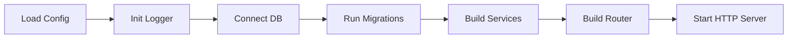

# Deployment

## MVP Deployment Targets

| Component | Recommended |
|---|---|
| Frontend | Vercel |
| Backend | Render |
| Database | Neon PostgreSQL |
| Object storage | Cloudinary or S3-compatible storage |
| Email | Resend |

## Current Production Smoke Test

The first production deploy should expose only:

```text
GET /health
GET /health/db
```

Use `/health` to verify the API process is running.

Use `/health/db` to verify the API can connect to the production PostgreSQL database.

## Environments

- Local
- Staging
- Production

Production should require:

- Passing CI
- Migration review
- Environment validation
- Rollback plan

## Docker

Backend Dockerfile should:

- Use multi-stage build
- Run as non-root user
- Copy only required files
- Expose configured port
- Use env vars

## Startup Order



## Release Process

1. Merge to main after CI passes.
2. Deploy backend to staging.
3. Run migrations on staging.
4. Smoke test `/health` and `/health/db`.
5. Deploy frontend to staging.
6. Promote to production.
7. Run production smoke test.

## Render Backend Deployment

Recommended settings for the current backend:

```text
Root Directory: server
Build Command: go build -o bin/api ./cmd/api
Start Command: ./bin/api
Health Check Path: /health
```

Set production environment variables:

```text
DATABASE_URL=<your Neon/Postgres connection string>
GIN_MODE=release
```

Render provides `PORT` automatically. The server reads `PORT`, then `APP_PORT`, then falls back to `8080`.

After deploy, verify:

```text
https://<your-backend-url>/health
https://<your-backend-url>/health/db
```

## Rollback

Backend rollback:

- Redeploy previous backend image.
- Avoid destructive migrations.
- Use backwards-compatible DB changes where possible.

Database rollback:

- Prefer forward fixes for production.
- Use down migrations only when safe and tested.

## Kubernetes

Kubernetes is not needed for MVP.

Consider Kubernetes only when:

- Multiple workers/services exist.
- Traffic requires horizontal scaling.
- The team can operate Kubernetes safely.
