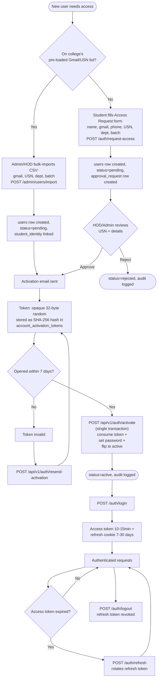
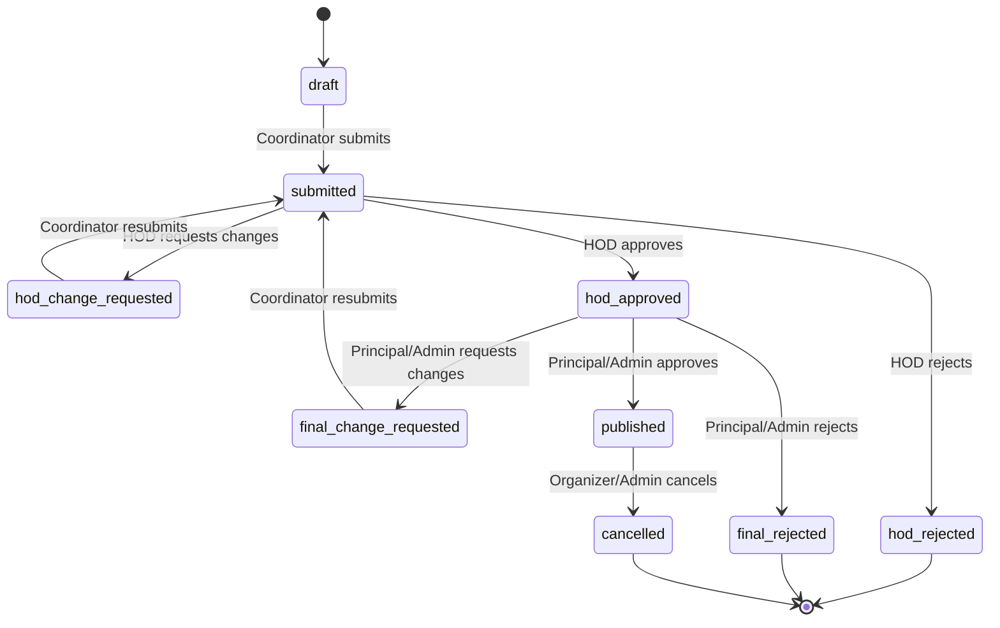
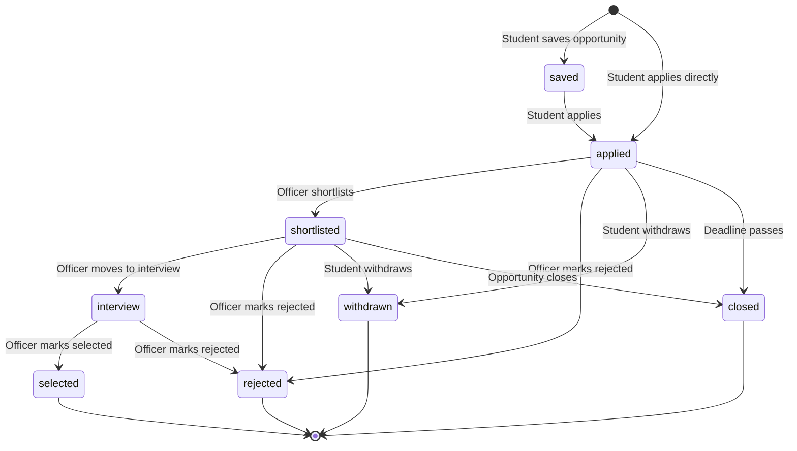
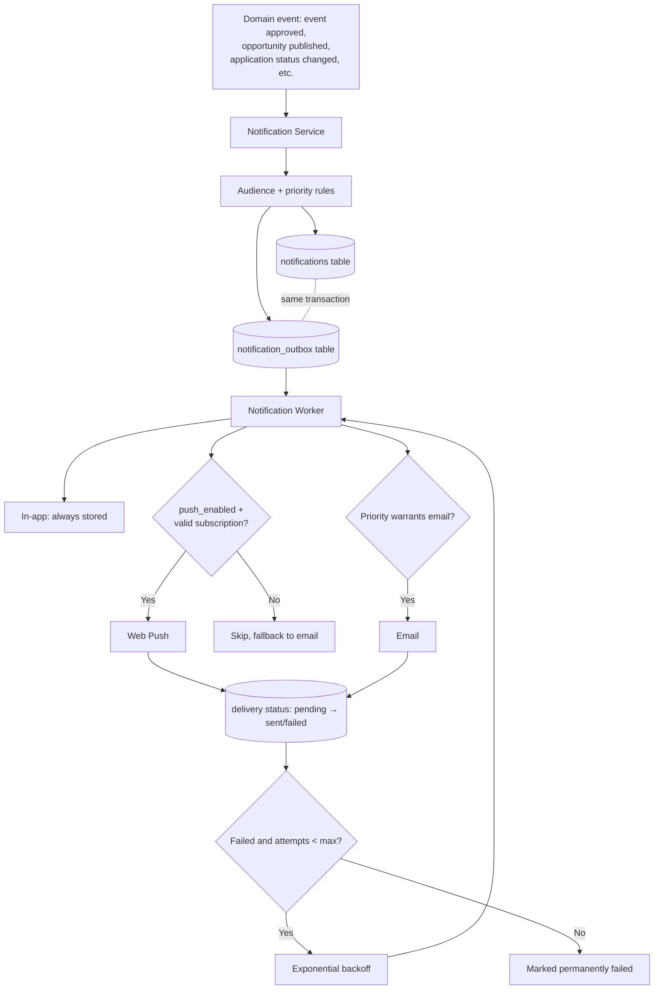

# LINKS — Full Project Flow

Covers the entire flow end to end: identity/access, every role's dashboard
actions, and how those actions feed into the shared subsystems (events,
opportunities, announcements, clubs, mentorship, notifications, admin).

The first diagram is the complete overview. The four after it zoom into
sub-flows that are too detailed to read inside the main diagram: identity &
access, event approval states, application states, and notification delivery.

---

## 1. Overall Flow (every role, every subsystem)

```mermaid
flowchart TB
    Visitor([New user]) --> AccessPath{On college's<br/>Gmail/USN list?}
    AccessPath -->|Yes| BulkImport[Admin/HOD bulk imports CSV]
    AccessPath -->|No| SelfRequest[Student submits access request]
    BulkImport --> Pending1[status: pending]
    SelfRequest --> Pending2[status: pending]
    Pending2 --> HODReview{HOD/Admin verifies USN}
    HODReview -->|Reject| Rejected([rejected])
    HODReview -->|Approve| ActivationEmail
    Pending1 --> ActivationEmail[Activation email sent]
    ActivationEmail --> SetPassword[User sets password via token link]
    SetPassword --> Active([status: active])
    Active --> Login[Login: access token + refresh cookie]
    Login --> RoleAssign[role_assignments: role + scope_type + scope_id]
    RoleAssign --> Router{Role-Based Dashboard Router}

    Router -->|student| Student
    Router -->|student_coordinator| Coordinator
    Router -->|faculty| Faculty
    Router -->|hod| HOD
    Router -->|placement_officer| Placement
    Router -->|principal| Principal
    Router -->|alumni| Alumni
    Router -->|club_organizer| ClubOrg
    Router -->|admin| Admin

    subgraph Student["Student"]
        S1[Dashboard: notices, open jobs,<br/>my applications, upcoming events]
        S2[Browse directory / departments / clubs]
        S3[Edit public profile]
        S4[Apply to opportunity]
        S5[RSVP to event]
        S6[Request mentorship]
        S7[Submit club interest]
    end

    subgraph Coordinator["Student Coordinator"]
        C1[All student actions]
        C2[Draft event proposal]
        C3[Respond to HOD change requests]
        C4[View approved events + RSVP counts]
    end

    subgraph Faculty["Faculty"]
        F1[Create department announcement]
        F2[View assigned events]
        F3[Mentor-review coordinator drafts if enabled]
    end

    subgraph HOD["HOD"]
        H1[Review own-department events]
        H2[Approve / reject / request changes]
        H3[Approve department announcements]
        H4[View department reports]
        H5[Limited role assignment, own dept only]
    end

    subgraph Placement["Placement Officer"]
        P1[Post opportunity + eligibility rules]
        P2[View applicant pipeline]
        P3[Shortlist / update status]
        P4[Export applicant CSV]
        P5[Post placement announcements]
    end

    subgraph Principal["Principal"]
        PR1[Final approval on events]
        PR2[College-wide placement snapshot]
        PR3[Department summary reports]
        PR4[Post college-wide announcements]
    end

    subgraph Alumni["Alumni"]
        A1[USN or admin-verified profile]
        A2[Toggle mentor availability]
        A3[Accept / decline mentorship requests]
    end

    subgraph ClubOrg["Club Organizer"]
        CL1[Manage club page]
        CL2[Review club interest submissions]
    end

    subgraph Admin["Admin"]
        AD1[User verification queue]
        AD2[Bulk import]
        AD3[Role assignment, all scopes]
        AD4[Content moderation]
        AD5[Audit log review]
        AD6[Final approval on events, full authority]
    end

    S4 --> Opportunities[("Opportunities &<br/>Applications")]
    P1 --> Opportunities
    P3 --> Opportunities
    Opportunities -. notifies .-> Notify

    S5 --> Events[("Events")]
    C2 --> Events
    H2 --> Events
    PR1 --> Events
    AD6 --> Events
    Events -. notifies .-> Notify

    F1 --> Announcements[("Announcements")]
    H3 --> Announcements
    P5 --> Announcements
    PR4 --> Announcements
    Announcements -. notifies .-> Notify

    S7 --> Clubs[("Clubs")]
    CL2 --> Clubs

    S6 --> Mentorship[("Mentorship")]
    A3 --> Mentorship
    Mentorship -. notifies .-> Notify

    AD1 --> AccessSystem[("Identity & Access")]
    AD2 --> AccessSystem
    AD3 --> AccessSystem
    HODReview -.-> AccessSystem

    Notify[("Notification Service:<br/>in-app + email + web push")]

    AD5 --> Audit[("Audit Logs")]
    P4 --> Audit
    H2 --> Audit
    PR1 --> Audit
    RoleAssign --> Audit
```

---

## 2. Identity & Access (detail)

---

## 3. Event Approval States

Every transition here is audit-logged (per `security.md`), and HOD/Principal
decisions with a negative or change-requested outcome require a note (per
`frontend-ux-ui.md`).

---

## 4. Opportunity Application States

`selected`, `shortlisted`, and same-day deadline transitions are the ones that
trigger critical-priority notifications (in-app + email + push) per
`notifications.md`. Everything else is high/normal priority.

---

## 5. Notification Delivery (outbox pattern)

Notifications and their outbox jobs are created in the **same transaction** as
the triggering action, so a business action (approval, status change) never
fails because of a notification-delivery problem — the failure mode is isolated
to the worker (ADR-009).

---

## Cross-reference

| Diagram               | Backs up                                                                                   |
| --------------------- | ------------------------------------------------------------------------------------------ |
| Overall flow          | `product-requirements.md`, `frontend-ux-ui.md` role dashboards, `auth.md` permission table |
| Identity & Access     | ADR-004, ADR-012 (once written), `auth.md`                                                 |
| Event Approval States | `frontend-contract.md` `EventApprovalStatus`, ADR-006                                      |
| Application States    | `frontend-contract.md` `OpportunityApplicationStatus`                                      |
| Notification Delivery | `notifications.md`, ADR-009                                                                |
