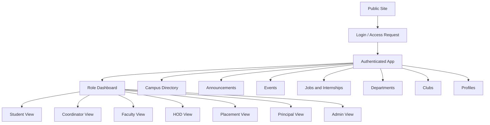
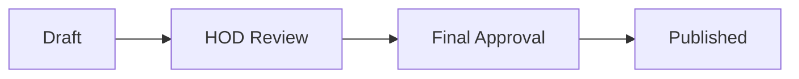

# Frontend UX and UI Strategy

## Purpose

This document defines how LINKS should feel, behave, and guide users. The frontend is not just a skin over APIs. It is where students understand what is happening, officers manage real work, HODs approve events, and admins keep the system trustworthy.

LINKS should feel like a calm, official, fast campus operating hub.

## Product Experience Thesis

LINKS should be:

- Clear before it is clever
- Official without feeling outdated
- Dense enough for repeated work
- Simple enough for students to understand immediately
- Role-aware without becoming confusing
- Mobile-friendly for students
- Desktop-efficient for admins, HODs, and placement workflows

The design should avoid a casual social-media feel. It should feel more like a polished academic operations product.

## UX Principles

1. Show relevant information first.
2. Hide irrelevant actions based on role.
3. Make approvals and statuses impossible to miss.
4. Prefer workflow surfaces over decorative dashboards.
5. Keep student views simple and action-oriented.
6. Keep office/admin views dense, filterable, and export-friendly.
7. Always explain what happens next after a user submits something.
8. Never rely only on color to communicate status.
9. Make empty states useful with a next action.
10. Treat mobile as a primary student experience, not an afterthought.

## Visual Direction

### Visual Thesis

Clean institutional workspace with crisp typography, restrained color, strong status hierarchy, and lightweight campus identity.

### UI Personality

- Trustworthy
- Focused
- Organized
- Modern
- Not playful like a social app
- Not heavy like old ERP software

### Avoid

- Generic SaaS card mosaics
- Large marketing hero sections inside the logged-in app
- Too many gradients
- Too many accent colors
- Decorative illustrations that do not help the workflow
- Chat-like UI patterns for non-chat workflows

## Information Architecture



## Navigation Model

### Desktop

Use a persistent left sidebar for authenticated app navigation.

Primary nav:

- Dashboard
- Announcements
- Events
- Jobs and Internships
- Directory
- Departments
- Clubs
- Mentors
- Saved

Role-specific nav:

- My Applications
- Event Drafts
- Approval Queue
- Placement Dashboard
- Applicant Lists
- User Management
- Reports

Top bar:

- Global search
- Notifications
- Role switcher if user has multiple roles
- Profile menu

### Mobile

Use bottom navigation for student-heavy routes:

- Home
- Events
- Jobs
- Notices
- Profile

Secondary pages can live behind a menu:

- Directory
- Clubs
- Departments
- Mentors
- Saved

Admin-heavy workflows may be usable on mobile but should be optimized for desktop first.

## Role-Based Home Screens

### Student Dashboard

Goal: Help students answer, "What should I know or do now?"

Content priority:

1. Urgent targeted announcements
2. Open placement opportunities
3. Application status updates
4. Upcoming events
5. Saved deadlines
6. Club and department updates

Recommended sections:

- Today / This Week
- Jobs Open For You
- My Applications
- Upcoming Events
- Department Notices
- Saved Items

### Student Coordinator Dashboard

Goal: Manage event proposals and approved events.

Content priority:

1. Draft events
2. Change requests
3. Pending approvals
4. Approved events
5. RSVP/participant counts

Recommended sections:

- Event Drafts
- Awaiting HOD Review
- Awaiting Final Approval
- Approved Events
- Participant Lists

### Faculty Dashboard

Goal: Share department updates and manage assigned academic/event responsibilities.

Content priority:

1. Announcement drafts
2. Assigned events
3. Department notices
4. Pending review items if faculty mentor review is enabled

Recommended sections:

- Create Announcement
- My Department Updates
- Assigned Events
- Student Coordinator Requests

### HOD Dashboard

Goal: Approve department activity and view department status.

Content priority:

1. Pending event reviews
2. Department announcements
3. Department events
4. Department participation and placement summary
5. Student coordinator management

Recommended sections:

- Approval Queue
- Department Activity
- Announcements
- Events
- Department Reports

### Placement Officer Dashboard

Goal: Operate the placement process efficiently.

Content priority:

1. Open opportunities
2. Applicant counts
3. Shortlisting board
4. Deadlines
5. Export/report actions

Recommended sections:

- Open Drives
- Applicant Pipeline
- Shortlisting
- Branch-wise Summary
- Closed Opportunities
- Reports

### Principal Dashboard

Goal: Give college-wide visibility without operational clutter.

Content priority:

1. College-wide pending approvals
2. Department activity overview
3. Event calendar
4. Placement summary
5. Announcement reach

Recommended sections:

- College Overview
- Pending Final Approvals
- Placement Snapshot
- Event Activity
- Department Summary

### Admin Dashboard

Goal: Maintain system trust and operational control.

Content priority:

1. User verification queue
2. Role management
3. Content moderation
4. Import tools
5. Audit-sensitive actions

Recommended sections:

- Pending Users
- User Import
- Role Assignments
- Review Queue
- Moderation
- Audit Logs

## Core Screens

### Notifications

Purpose: Keep users informed even when they miss dashboard updates.

The UI should include:

- Bell icon with unread count
- Notification drawer or full notification page
- Priority labels for important updates
- Mark as read
- Mark all as read
- Link to related event, opportunity, announcement, or approval

Web push permission should not be requested immediately on first visit. Ask after a relevant moment, such as after account activation or when a student opens the Jobs page.

Placement notifications should clearly tell the student that an opportunity or application status changed, but sensitive details should require opening LINKS after login.

### Account Pending

**Route:** `/account-pending`

**Trigger:** An authenticated user whose account has zero role assignments (e.g., activated but not yet verified/approved by an admin or HOD).

**Purpose:** Explain the incomplete state and tell the user to contact an administrator. This is a dead-end route — the user cannot proceed into the app until a role is assigned.

**UX rules:**
- Show a clear message: "Your account has been created, but no role has been assigned yet."
- Provide a single action: Log out (so the user can retry later or use a different account).
- Do not show navigation or sidebar — the user cannot access the app without roles.
- This state is enforced centrally in `ProtectedRoute`, not per-page.

### Access Request

Fields:

- Full name
- Gmail/email
- Phone optional
- USN
- Department
- Batch/admission year

UX rules:

- Explain that access is verified by admin/HOD.
- Validate USN early.
- Show clear pending state after submission.
- Do not imply instant access.

### Public Profile

Purpose: A verified, shareable identity page.

Show:

- Name
- Role
- Department
- Batch/designation
- USN where appropriate
- Headline
- Skills/interests
- LinkedIn/important links if user enabled them
- Verification badge

Hide by default:

- Phone
- Email unless user enabled it
- Private placement/application data

### Edit Profile

**Route:** `/profile/edit`

**Purpose:** Allow the user to update their profile information.

**Fields:**
- Headline (text, optional)
- Bio (textarea, optional)
- Social links: LinkedIn, GitHub, Portfolio (URL inputs, optional)
- Privacy toggles: show email, show phone on public profile

**UX rules:**
- Pre-populate form with current values fetched from the `/me` endpoint
- Validate URLs format where provided
- Show "Saving…" loading state on submit button
- Preserve entered data on validation error
- Redirect to Dashboard on success
- Provide a "Cancel" button returning to Dashboard

### Announcements

UX goals:

- Make targeted notices easy to scan.
- Show audience context.
- Separate official, department, placement, and club notices.

Filters:

- Department
- Batch/year
- Role
- Type
- Date
- Read/unread later

Announcement cards should show:

- Title
- Publisher
- Audience
- Date
- Expiry if any
- Status for drafts/reviews

### Event Detail

Show:

- Title
- Date/time
- Venue
- Organizer
- Department/club
- Audience
- Approval status for organizers/admins
- RSVP action for students
- Participant export for authorized users

UX rules:

- Students see simple RSVP/Interested actions.
- Coordinators see draft and approval progress.
- HOD/admin see review actions with decision notes.

### Event Approval Screen

Approval decision should be deliberate.

Reviewer sees:

- Event details
- Organizer/coordinator
- Audience
- Venue/date
- Faculty mentor if any
- Expected participants
- Previous review notes

Actions:

- Approve
- Request changes
- Reject

Every decision should require or allow a note depending on action:

- Reject requires note.
- Request changes requires note.
- Approve note optional.

### Placement Opportunity Detail

Student view:

- Company/source
- Role/title
- Eligibility
- Deadline
- Application mode
- Apply or mark external application completed
- My status

Placement officer view:

- Edit opportunity
- Applicant count
- Eligibility preview
- Applicant list
- Shortlisting actions
- Export

### Applicant List

This is an operational screen, not a decorative dashboard.

Required features:

- Search by name, USN, email
- Filter by department
- Filter by batch
- Filter by status
- Filter by eligibility
- Bulk status update if safe
- Export CSV

Table columns:

- Student name
- USN
- Department
- Batch
- Application status
- Applied at
- External application confirmation
- Notes/action

## Status Design

Use consistent status language and visual treatment.

### Event Statuses

| Status | Tone |
|---|---|
| Draft | Neutral |
| Submitted | Waiting |
| HOD change requested | Warning |
| HOD rejected | Negative |
| HOD approved | Positive-progress |
| Final change requested | Warning |
| Final rejected | Negative |
| Published | Positive |
| Cancelled | Muted-negative |

### Application Statuses

| Status | Tone |
|---|---|
| Saved | Neutral |
| Applied | Waiting |
| Shortlisted | Positive-progress |
| Interview | Active |
| Selected | Success |
| Rejected | Negative |
| Withdrawn | Muted |
| Closed | Muted |

Status components must include text, not only color.

## Design System Direction

### Layout

- Use app-shell layout after login.
- Use sidebar on desktop.
- Use bottom nav on student mobile.
- Use tables for dense operational data.
- Use cards only for discrete repeated items like events, jobs, and announcements.
- Avoid cards inside cards.

### Typography

- Use a clean sans-serif typeface.
- Keep headings compact inside product UI.
- Avoid huge hero-style typography inside dashboards.
- Use numeric tabular styles for counts where possible.

### Color

Use a restrained palette:

- Neutral background
- Strong readable text
- One primary accent
- Semantic colors for status

Avoid a one-note blue/purple dashboard. The interface should feel official and readable, not decorative.

### Components

Needed components:

- App shell
- Sidebar
- Top bar
- Bottom nav
- Role switcher
- Global search
- Data table
- Filters
- Status badge
- Timeline/progress stepper
- Approval panel
- Empty state
- Toast
- Modal/drawer
- Form field
- File upload
- CSV import preview

## Interaction Patterns

### Approval Progress

Use a stepper for event approval.



### Role Switching

If a user has multiple roles:

- Show active role in top bar.
- Let user switch role context.
- Keep permissions enforced by backend.
- Avoid mixing all role actions into one confusing screen.

### Forms

Forms should:

- Save drafts where workflows are long.
- Show validation inline.
- Preserve entered data after validation errors.
- Show final confirmation for approval/reject/shortlist actions.
- Clearly state what happens after submit.

### Tables

Operational users need fast scanning.

Tables should support:

- Search
- Sort
- Filter
- Pagination
- Bulk selection where safe
- Export where authorized

## Empty, Loading, and Error States

### Empty States

Good empty states answer:

- Why is this empty?
- What can I do next?

Examples:

- No jobs open for your branch right now.
- No event drafts yet. Create an event proposal.
- No pending approvals in your department.

### Loading States

- Use skeletons for dashboards and lists.
- Use button-level loading for submit actions.
- Prevent duplicate submissions.

### Error States

- Show clear, human-readable error text.
- Preserve form input.
- Provide retry when safe.
- Do not expose raw backend errors.

## Accessibility

Requirements:

- Keyboard navigation for all controls.
- Visible focus states.
- Proper labels for forms.
- Semantic buttons and links.
- Color contrast meets WCAG AA.
- Status is communicated with text and color.
- Tables have proper headers.
- Modals trap focus and close predictably.

## Responsive Strategy

### Mobile First For Students

Student flows must work well on mobile:

- Dashboard
- Notices
- Events
- Jobs
- Applications
- Profile

### Desktop First For Operations

Operational flows should be optimized for desktop:

- Applicant lists
- CSV import/export
- Shortlisting
- User management
- Approval queues
- Reports

## Performance UX

- Dashboard should load fast.
- Use route-level code splitting.
- Use TanStack Query caching.
- Prefetch common details when useful.
- Use optimistic updates only for reversible low-risk actions like save/unsave.
- Do not optimistic-update approvals or shortlisting without server confirmation.

## Frontend Folder Direction

Recommended structure:

```text
client/src/
  app/
    router.tsx
    providers.tsx
    layout/
  features/
    auth/
    dashboard/
    profiles/
    announcements/
    events/
    opportunities/
    applications/
    departments/
    clubs/
    admin/
  shared/
    api/
    components/
    hooks/
    icons/
    utils/
    styles/
```

Rules:

- Organize by feature, not by file type only.
- Keep API hooks near feature code.
- Keep shared UI truly reusable.
- Avoid a giant `components/` dumping ground.

## UI Quality Checklist

Before shipping a frontend screen:

- Does the page answer the user's main question immediately?
- Is the primary action obvious?
- Are role-specific actions hidden when irrelevant?
- Are statuses readable without relying on color?
- Does mobile layout work for student tasks?
- Does desktop layout work for operational tasks?
- Are empty/loading/error states designed?
- Are forms accessible and recoverable?
- Is the backend still enforcing permissions?
