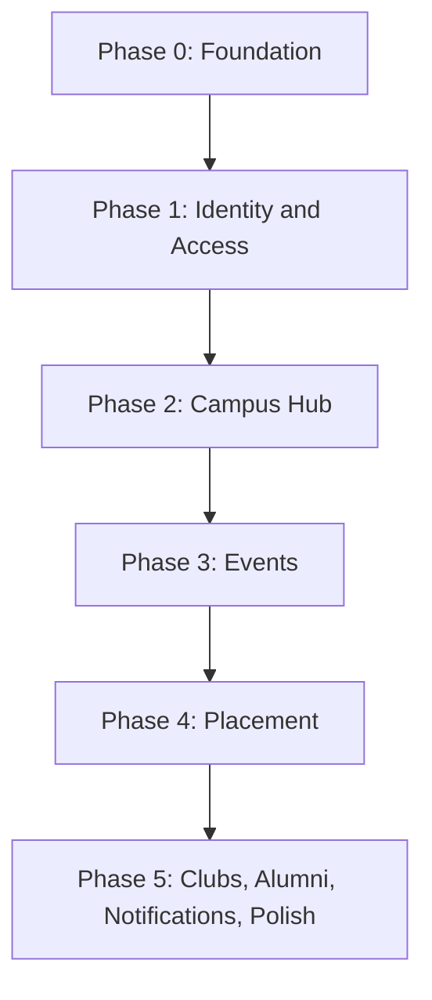

# LINKS — Implementation Doc

### Build sequence, and who does what (AI agent vs. you)

---

## 0. What This Doc Is (and Isn't)

This is **not** another spec. The specs already exist and are good:
`product-requirements.md`, `architecture.md`, `database-design.md`, `api-spec.md`, `auth.md`,
`security.md`, `frontend-ux-ui.md`, `frontend-contract.md`, `notifications.md`, `scaling.md`,
`deployment.md`, `environment.md`, `monitoring.md`, `backend-standards.md`, `decision-log.md`,
`roadmap.md`.

This doc answers three questions those files don't answer:

1. **In what order do we build this** so nothing gets blocked on something that doesn't exist yet?
2. **At each step, what should the AI agent do, and what should you do yourself** — because some things (provisioning accounts, real MITT data, design taste, manual verification, official decisions) genuinely cannot be delegated?
3. **How do we know a step is actually done**, not just "code exists"?

No code lives in this document. Code is produced during the actual build sessions, by the agent, following the docs.

### Note on `My_Plan.md` vs. the `docs/` folder

`My_Plan.md` is the original v5.0 vision document. The `docs/` folder is a more detailed, slightly evolved v4.0 technical blueprint — e.g. `My_Plan.md` §7 sketches a flat `role` column on `users`, while `database-design.md` (the current source of truth, per ADR-005) uses a separate scoped `role_assignments` table. **Wherever the two disagree, `docs/` wins.** Per `AGENTS.md`, `My_Plan.md` stays frozen unless you explicitly ask to change it — this implementation doc follows `docs/`.

---

## 1. How the Agent and You Should Actually Work Together

**Agent's job:** scaffolding, repetitive CRUD that follows a written spec exactly, migrations generated from `database-design.md`, layered code that follows `backend-standards.md`/`architecture.md`, tests, boilerplate UI that follows `frontend-ux-ui.md`.

**Your job:** anything that requires real-world information the docs don't (and can't) contain, anything that requires a judgment call, anything that requires clicking a button on an external dashboard, and anything that requires verifying the product feels right as an actual user.

Concretely, your job is:

- Provisioning every external account, key, and secret.
- Supplying real MITT data (USN format, department codes, eligibility rules, branding).
- Making product decisions the docs flagged as open or ambiguous.
- Reviewing and approving every migration before it touches staging/production.
- Manually testing each phase end-to-end as a real user, in each relevant role.
- Approving new entries in `decision-log.md` — these are official records, not boilerplate.
- Visual/UX taste calls on screens the agent builds, against the `frontend-ux-ui.md` checklist.

**Per-task loop, every time:**

1. Look up the task type in the `AGENTS.md` Task-to-Doc Map.
2. Tell the agent the task and name the docs from that map. Let it read them before writing anything.
3. Have it implement in one small, reviewable unit at a time (one endpoint, one screen, one migration) — not a whole phase in one shot.
4. You verify against that step's Definition of Done before moving to the next step.
5. If a new decision got made along the way, it goes in `decision-log.md`, and the relevant doc gets updated (per `AGENTS.md` Documentation Rules) — `My_Plan.md` excluded.

---

## 2. Before Any Code: Provisioning (You — manual, agent cannot do this)

Do this first, in this order, before Phase 0 starts:

1. GitHub repository — mono-repo with `client/` and `server/` at the root, matching `architecture.md`'s recommended structure.
2. Neon PostgreSQL project — get the connection string for at least a dev/staging database.
3. Vercel account — for the frontend and backend Services deployment described in `deployment.md`.
4. Generate JWT signing secrets and decide where they'll live per environment (local `.env.local`, Vercel environment variables) — per `environment.md` rules: no secrets in git, different secrets per environment.
5. Decide whether the beta status of Vercel Services is acceptable before the first production deployment. If not, record a replacement hosting decision in `decision-log.md`.
6. Resend account and Cloudinary/S3 account — these aren't needed until Phase 5 (email/push) and whenever media upload is built, so they can be deferred, but create the accounts early so you're not blocked mid-phase.

None of this can be delegated — the agent has no way to create accounts or hold credentials.

---

## 3. Build Order — Overview

This follows `roadmap.md` and `My_Plan.md` §13, in strict dependency order. Do not skip ahead — every later phase assumes the previous one's data model and auth already exist.

Why this exact order: Phase 1 (auth + RBAC) gates literally everything else, since every endpoint after it needs an authenticated actor and a policy check. Phase 2 (announcements, directory, dashboards) is built next because Events and Placement both reuse its audience-targeting and dashboard patterns. Events comes before Placement because the approval-workflow pattern (draft → review → final approval) it establishes is reused, in simplified form, nowhere else as cleanly — but more practically, because `roadmap.md` and ADR ordering place official record-keeping (events) ahead of the more isolated Placement module. Notifications are deliberately last for email/push specifically — `notifications.md` Phase 1 (in-app only) gets built alongside Events/Placement as those workflows are built, while email/push/preferences are saved for Phase 5 once there's enough real activity to actually need them.

---

## 4. Phase 0 — Foundation

**Goal:** an empty but real, deployed, observable system. No features yet.

**Docs to load first:** `architecture.md`, `backend-standards.md`, `environment.md`, `deployment.md`, `monitoring.md` (this is the "Deployment/config" + "Backend architecture" row of the `AGENTS.md` map).

| Step | What                                                                                                                                                                               | Who                                                      |
| ---- | ---------------------------------------------------------------------------------------------------------------------------------------------------------------------------------- | -------------------------------------------------------- |
| 4.1  | Scaffold `server/` and `client/` folders exactly matching `architecture.md`'s recommended structure (`cmd/api`, `cmd/worker`, `internal/...`, `migrations/`, `tests/integration/`) | Agent                                                    |
| 4.2  | Explicit `config.Load()` with validation, fail-fast on missing required vars from `environment.md`, no `init()` side effects                                                       | Agent                                                    |
| 4.3  | Structured JSON logger + request-ID middleware                                                                                                                                     | Agent                                                    |
| 4.4  | DB connection with pool settings from `database-design.md` defaults                                                                                                                | Agent                                                    |
| 4.5  | Pick and wire a SQL migration tool (e.g. a migrate-style CLI) — this is a small technical decision not pinned in the docs                                                          | Agent proposes, you approve, log it in `decision-log.md` |
| 4.6  | Standard success/error response envelope per `api-spec.md`                                                                                                                         | Agent                                                    |
| 4.7  | `GET /api/health` and `GET /api/ready` per `api-spec.md` and `deployment.md` smoke test                                                                                            | Agent                                                    |
| 4.8  | Minimal CI (build, vet, test on PR)                                                                                                                                                | Agent                                                    |
| 4.9  | First preview deployment: configure Vercel Services per `deployment.md`, set `DATABASE_URL`, `APP_ENV`, and `GIN_MODE`                                                            | **You**                                                  |
| 4.10 | Verify `/api/health` and `/api/ready` against the preview database                                                                                                                | **You**                                                  |
| 4.11 | Frontend scaffold: Vite + TypeScript base and an empty app-shell layout per `frontend-ux-ui.md`; add Tailwind/shadcn only when the first product screen needs them              | Agent                                                    |
| 4.12 | Verify the frontend and API share the same Vercel preview domain                                                                                                                   | **You**                                                  |

**Definition of Done for Phase 0:**

- Migrations run cleanly against a fresh database.
- `/api/health` and `/api/ready` return 200 in production.
- CI is green on the repo.
- No secret values exist anywhere in git history.
- A request produces a structured log line with `request_id`.

---

## 5. Phase 1 — Identity and Access

This is the highest-risk phase. Every other module depends on its data model and its RBAC policy layer being right. Don't rush it, and don't let the agent start Events/Placement work before this is solid.

**Docs to load:** `architecture.md`, `backend-standards.md`, `decision-log.md` (Backend architecture); `auth.md`, `security.md`, `database-design.md` (Authentication/RBAC); `api-spec.md`, `frontend-contract.md` (API changes).

| Step | What                                                                                                                                                                                                                   | Who                                                                                                                                                  |
| ---- | ---------------------------------------------------------------------------------------------------------------------------------------------------------------------------------------------------------------------- | ---------------------------------------------------------------------------------------------------------------------------------------------------- |
| 5.1  | Migrations: `users`, `profiles`, `student_identities`, `departments`, `role_assignments`, `audit_logs` per `database-design.md`                                                                                        | Agent writes, **you review and approve before running on staging** (migration review is a hard requirement per `deployment.md`)                      |
| 5.2  | Password hashing (Argon2id)                                                                                                                                                                                            | Agent                                                                                                                                                |
| 5.3  | Auth service: login, refresh, logout, request-access                                                                                                                                                                   | Agent                                                                                                                                                |
| 5.4  | JWT issuing + rotating, hashed refresh-token storage, revoke-on-suspend                                                                                                                                                | Agent                                                                                                                                                |
| 5.5  | Cookie strategy (`HttpOnly`, `Secure`, `SameSite`, `__Host-` prefix)                                                                                                                                                   | Agent implements; **you decide `COOKIE_SECURE`/`CORS_ALLOWED_ORIGINS` per environment**                                                              |
| 5.6  | Auth middleware + actor extraction                                                                                                                                                                                     | Agent                                                                                                                                                |
| 5.7  | RBAC policy layer using scoped `role_assignments` (role + scope_type + scope_id) per ADR-005                                                                                                                           | Agent                                                                                                                                                |
| 5.8  | Admin/HOD verification + access-approval flow, with audit logging                                                                                                                                                      | Agent                                                                                                                                                |
| 5.9  | Approval-triggered Gmail activation per ADR-012: 32-byte random, single-use, SHA-256-hashed token; 7-day link; user sets the password through `/activate`; synchronous Resend delivery for MVP | Agent implements; **you verify a real delivered link in the Vercel preview/staging environment**                                                        |
| 5.10 | Profile CRUD: own profile + public profile by username                                                                                                                                                                 | Agent                                                                                                                                                |
| 5.11 | **You must supply:** the real MITT USN format/regex, the real list of valid department codes, valid batch-year ranges. The agent cannot invent these — get them wrong and every later filter/eligibility rule breaks   | **You**                                                                                                                                              |
| 5.12 | Security test cases from `security.md` (cross-department denial, suspended-user denial, private-field hiding)                                                                                                          | Agent writes the tests; **you manually re-run the cross-department and suspended-user cases by hand once, logged in as two different test accounts** |
| 5.13 | Frontend: Access Request screen, Login screen, per fields/UX rules in `frontend-ux-ui.md`                                                                                                                              | Agent builds structure; **you supply real copy, MITT branding/colors, and the exact "pending verification" wording**                                 |
| 5.14 | Frontend: auth context, silent token refresh, protected routes                                                                                                                                                         | Agent                                                                                                                                                |
| 5.15 | Automated and manual run-through: request access → admin approves → activation-link UI → login → edit profile → refresh/logout, for at least a student and an admin account                                            | Agent maintains the isolated Playwright suite; **you complete the final preview/staging run-through**                                                 |

**Current release-candidate status (2026-08-28):** the Phase 1 PR passes all Go
tests, vet, API/client builds, lint, and 12 isolated-schema Playwright tests. It
remains **Ready for Dev Verification** until the Vercel preview is tested, the
PR review/CI gates pass, and the developer signs off. Do not treat the automated
run as the manual Definition of Done.

**Definition of Done for Phase 1:**

- A new user can request access, get approved, log in, and edit their profile end to end, in production or staging.
- A student cannot reach another department's data; this was checked by hand, not just by an automated test.
- No password hash, refresh token, or `password_hash` field ever appears in an API response — verified by hand once.

---

## 6. Phase 2 — Campus Hub

**Docs to load:** `roadmap.md`, `product-requirements.md` (Product planning); `frontend-ux-ui.md`, `frontend-contract.md` (Frontend); `api-spec.md` (API).

| Step | What                                                                                                                                                                                                                                                        | Who                                                                                                                                                                   |
| ---- | ----------------------------------------------------------------------------------------------------------------------------------------------------------------------------------------------------------------------------------------------------------- | --------------------------------------------------------------------------------------------------------------------------------------------------------------------- |
| 6.1  | Department CRUD + seed the **real** MITT department list (codes, names, HOD mapping)                                                                                                                                                                        | **You supply the data**, agent seeds it                                                                                                                               |
| 6.2  | Role-based dashboard endpoints — build the **student** one first since it's used the most, then the rest                                                                                                                                                    | Agent                                                                                                                                                                 |
| 6.3  | Campus directory with filters, Postgres full-text/trigram search per `scaling.md`                                                                                                                                                                           | Agent                                                                                                                                                                 |
| 6.4  | Announcements: model, audience-rule targeting engine, CRUD                                                                                                                                                                                                  | Agent                                                                                                                                                                 |
| 6.5  | **Open decision:** `product-requirements.md` says HOD/admin approval is "applied if required" for announcements without saying which announcement types require it. Decide the rule (e.g. department-only notices skip approval, college-wide ones need it) | **You decide**, log in `decision-log.md`, then agent implements the gate                                                                                              |
| 6.6  | Frontend: role dashboards, directory, department pages, announcement feed + composer, per `frontend-ux-ui.md`                                                                                                                                               | Agent builds; **you review every screen against the UI Quality Checklist in `frontend-ux-ui.md`** — this is the doc's most concrete acceptance test, use it literally |
| 6.7  | Manual UX pass across at least student + HOD views                                                                                                                                                                                                          | **You**                                                                                                                                                               |

**Definition of Done for Phase 2:**

- A student dashboard shows only that student's department-relevant content.
- An announcement targeted at "EC, 2nd year" is invisible to other departments/years — checked by hand with two test accounts.
- Every screen built so far passes the `frontend-ux-ui.md` checklist.

---

## 7. Phase 3 — Events

**Docs to load:** `product-requirements.md` (event approval workflow), `database-design.md` (`events`, `approval_requests`, `event_rsvps`), `api-spec.md`, `frontend-contract.md` (`EventApprovalStatus` enum), `frontend-ux-ui.md` (event detail, approval screen, stepper), `notifications.md` (Phase 1 — in-app only, defer email/push).

| Step | What                                                                                                                              | Who                                                                                                                                                                                               |
| ---- | --------------------------------------------------------------------------------------------------------------------------------- | ------------------------------------------------------------------------------------------------------------------------------------------------------------------------------------------------- |
| 7.1  | Migrations: `events`, `approval_requests`, `event_rsvps`                                                                          | Agent                                                                                                                                                                                             |
| 7.2  | Event draft CRUD, scoped to the creating coordinator                                                                              | Agent                                                                                                                                                                                             |
| 7.3  | HOD review endpoint + state transitions (submitted → hod_change_requested / hod_rejected / hod_approved)                          | Agent                                                                                                                                                                                             |
| 7.4  | Final approval endpoint (principal/admin)                                                                                         | Agent                                                                                                                                                                                             |
| 7.5  | RSVP endpoint + audited participant CSV export                                                                                    | Agent                                                                                                                                                                                             |
| 7.6  | In-app notification records wired to event-lifecycle transitions (Phase 1 of `notifications.md` only — no email/push channel yet) | Agent                                                                                                                                                                                             |
| 7.7  | Frontend: event drafts, approval queue, decision screen with the approval stepper, event detail + RSVP, participant list          | Agent builds; **you confirm the real event-type list matches what coordinators actually propose, and sit in the HOD/principal seat to judge whether the approval screen feels deliberate enough** |
| 7.8  | Full workflow test across three real test accounts (coordinator, HOD, admin) — propose, request changes, resubmit, approve, RSVP  | **You** — this one genuinely can't be done meaningfully any other way                                                                                                                             |

**Definition of Done for Phase 3:**

- An event survives the full draft → HOD review → final approval → published path with at least one "request changes" loop, tested by hand.
- A non-HOD cannot approve an event outside their department — checked by hand.
- The participant export is logged in `audit_logs`.

---

## 8. Phase 4 — Placement

**Docs to load:** `database-design.md` (`opportunities`, `opportunity_applications`), `api-spec.md`, `frontend-contract.md` (`OpportunityApplicationStatus`), `frontend-ux-ui.md` (Applicant List, Opportunity Detail), `security.md` + ADR-008 (applicant-data visibility rules).

| Step | What                                                                                                                                                                                                                | Who                                                                                                                                                                                                                                         |
| ---- | ------------------------------------------------------------------------------------------------------------------------------------------------------------------------------------------------------------------- | ------------------------------------------------------------------------------------------------------------------------------------------------------------------------------------------------------------------------------------------- |
| 8.1  | Migrations: `opportunities`, `opportunity_applications`                                                                                                                                                             | Agent                                                                                                                                                                                                                                       |
| 8.2  | Opportunity CRUD, JSONB eligibility rules, eligibility-matching logic                                                                                                                                               | Agent implements the engine; **you supply the real eligibility fields used at MITT — CGPA scale, branch list, any skill taxonomy**                                                                                                          |
| 8.3  | Apply flow: internal application + external-application confirmation                                                                                                                                                | Agent                                                                                                                                                                                                                                       |
| 8.4  | Applicant list, filters, shortlist actions, status transitions, strictly enforcing ADR-008 (student sees own only; HOD sees department summary only, not the full list; placement officer/principal/admin see full) | Agent implements; **you manually log in as an HOD and confirm you cannot see individual applicant rows, only the summary** — this is the single most security-sensitive screen in the product, worth checking by hand every time it changes |
| 8.5  | CSV export + audit logging                                                                                                                                                                                          | Agent                                                                                                                                                                                                                                       |
| 8.6  | Frontend: opportunity detail (student view + officer view), the dense operational applicant table, shortlisting board                                                                                               | Agent builds; **you give real feedback on the table as the daily-use tool it is — this is the screen placement staff will live in, so it's worth the most design scrutiny of any screen in the app**                                        |
| 8.7  | Full pipeline test: apply → shortlist → interview → select → export, verify the CSV columns and the audit trail                                                                                                     | **You**                                                                                                                                                                                                                                     |

**Definition of Done for Phase 4:**

- A full applicant pipeline runs end to end with a real test student account.
- HOD visibility is confirmed by hand to be summary-only.
- Export produces a correct CSV and an audit log row.

---

## 9. Phase 5 — Clubs, Alumni, Full Notifications, Polish

**Docs to load:** `notifications.md` (full document), `database-design.md`, `security.md`, `scaling.md`.

The required club, alumni, and mentorship tables are already defined in `database-design.md`. Review them against current college policy before building Phase 5.

| Step | What                                                                                                                                                            | Who                                                                                                                                                                                           |
| ---- | --------------------------------------------------------------------------------------------------------------------------------------------------------------- | --------------------------------------------------------------------------------------------------------------------------------------------------------------------------------------------- |
| 9.1  | Review existing club/alumni/mentorship tables in `database-design.md` against current college policy; add only approved gaps, preserving existing schema references and conventions (UUID keys, `timestamptz`, explicit migrations) | Agent drafts gaps if any; **you approve**, then updates go to `database-design.md` and `decision-log.md` per `AGENTS.md`'s documentation rule                                                |
| 9.2  | Club pages + join-interest form                                                                                                                                 | Agent                                                                                                                                                                                         |
| 9.3  | Alumni profile + USN-based verification (reusing Phase 1's logic)                                                                                               | Agent                                                                                                                                                                                         |
| 9.4  | Mentorship request flow                                                                                                                                         | Agent                                                                                                                                                                                         |
| 9.5  | Email notifications: Resend integration, `notification_outbox` table, worker, templates, retry logic                                                            | Agent builds; **you provision the Resend API key and verify the sending domain's DNS records**                                                                                                |
| 9.6  | Web push: service worker, push-subscription API, delivery worker, permission-prompt timing per `notifications.md`                                               | Agent implements; **you generate the VAPID keypair and decide the exact prompt copy/moment, since this is a one-shot UX decision — denied permission shouldn't be re-asked**                  |
| 9.7  | Notification preferences UI + backend                                                                                                                           | Agent                                                                                                                                                                                         |
| 9.8  | Decide whether to introduce Redis yet                                                                                                                           | Per ADR-007, only if `monitoring.md` data shows a real need — **this is your call to make off real metrics, not preemptively**, with the agent helping interpret `scaling.md`'s decision flow |
| 9.9  | Accessibility pass: focus states, ARIA labels, contrast tokens                                                                                                  | Agent does the technical work; **you do one full manual keyboard-only and screen-reader pass — automated checks miss real usability gaps**                                                    |
| 9.10 | Mobile responsive polish                                                                                                                                        | Agent + you, ideally pairing on a real phone for the student-facing flows                                                                                                                     |
| 9.11 | Full security suite: `security.md` test cases, `govulncheck`, `gosec`                                                                                           | Agent runs and fixes findings; **you review the report before calling it done**                                                                                                               |

**Definition of Done for Phase 5:**

- A test email and a test push notification both arrive for a real test action.
- Accessibility pass completed by a human, not just a linter.
- Security scan report reviewed with no unresolved high-severity findings.

---

## 10. Practices That Run Through Every Phase, Not Just One

- Before merging anything, run the **Definition of Done** checklist from `backend-standards.md` (contract documented, validation implemented, authorization enforced, business logic tested, migration added, audit log added where sensitive, no sensitive fields leaked).
- Any new product or architecture decision gets a `decision-log.md` entry — agent can draft the ADR text, but **you approve the wording**, since these are the project's official record.
- Before starting any new task, check the `AGENTS.md` Task-to-Doc Map yourself and tell the agent which docs apply — don't let it guess.
- If reality ever diverges from a doc, update the doc. The one exception is `My_Plan.md`, which stays frozen unless you explicitly ask to change it.
- As new env vars get activated phase by phase (JWT secrets in Phase 1, storage/email keys in Phase 5's lead-up, VAPID keys in Phase 5), keep `environment.md` in sync with what `config.go` actually validates.

---

## 11. Quick Reference: Things Only You Can Provide

Pulled together from every phase above, so you can prep ahead of time:

- GitHub/Neon/Render/Vercel/Resend/storage accounts and their secrets.
- The real MITT USN format and department code list.
- Real department names and HOD mapping.
- Real event-type list (if it differs from the docs' example list).
- Real placement eligibility fields (CGPA scale, skill taxonomy).
- All branding, copy, and visual taste decisions.
- The Gmail-invite mechanics decision (Phase 1).
- The announcement-approval-gate decision (Phase 2).
- Every migration review/approval before staging.
- Every cross-role manual security check (cross-department, applicant-visibility, suspended-user).
- VAPID key generation and push-prompt copy (Phase 5).
- The Redis-or-not call (Phase 5), based on real metrics.
- Final review of every `decision-log.md` entry.

---

## 12. Suggested First Session

A concrete starting sequence, once provisioning (Section 2) is done:

1. "Read `architecture.md` and `backend-standards.md`, then scaffold the `server/` folder structure exactly as `architecture.md` describes — Step 4.1."
2. "Now add explicit config loading per `environment.md`'s required-variable list — Step 4.2."
3. Continue down the Phase 0 table in order, one row per message, verifying each before moving to the next.
4. Don't start Phase 1 until Phase 0's Definition of Done is fully checked off.
