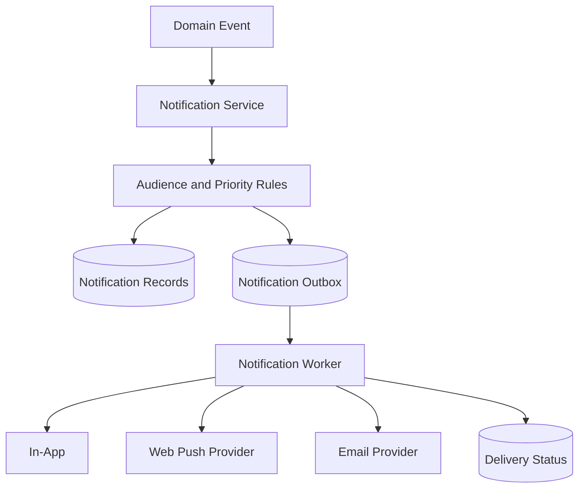

# Notifications

## Purpose

Notifications are critical for LINKS because students may not keep the web app open. Important placement links, shortlisting updates, event approvals, and official announcements must still reach the right users.

LINKS should use a multi-channel notification system:

- In-app notifications
- Web push notifications
- Email notifications
- Optional SMS/WhatsApp-style channel later, only if the college officially supports it

## Core Principle

Do not depend on only one notification channel.

Web push is useful when the app is closed, but it depends on browser support, service worker registration, device settings, and user permission. Email is slower but more reliable for official communication. In-app notifications provide the permanent record.

## Notification Channels

| Channel | Use Case | Works When App Closed? | Notes |
|---|---|---:|---|
| In-app | Notification center, unread count, audit trail | No | Always store important notifications here |
| Web push | Urgent student-facing updates | Yes, if permission is granted | Requires service worker and browser permission |
| Email | Official fallback and important updates | Yes | Best for placement links and formal notices |
| SMS/External | Critical reminders later | Yes | Defer until college has approved provider/process |

## MVP Recommendation

Build these in order:

1. In-app notification center
2. Email notifications for important updates
3. Web push notifications for opted-in users
4. Digest preferences and notification settings

For placement opportunities and shortlisting, use both email and web push when available.

## Notification Types

### Student Notifications

Notify students for:

- New placement opportunity matching their eligibility
- Placement application deadline reminder
- Application status changed
- Shortlisted for opportunity
- Selected/rejected update
- Important department announcement
- Event RSVP confirmation
- Event date/time change
- Event cancellation
- Mentorship request update

### Student Coordinator Notifications

Notify coordinators for:

- Event draft submitted successfully
- HOD requested changes
- HOD rejected event
- HOD approved event
- Principal/admin requested changes
- Final approval/rejection
- Event RSVP count milestone if useful later

### HOD Notifications

Notify HODs for:

- New department event waiting for review
- Coordinator resubmitted event after changes
- Department announcement approval needed if enabled
- Department participation summary digest

### Placement Officer Notifications

Notify placement officer for:

- New applicants for an opportunity
- Application deadline reached
- Export completed
- High applicant volume if useful later

### Principal/Admin Notifications

Notify principal/admin for:

- Event waiting for final approval
- High-priority announcement approval
- User import completed
- Suspicious or failed import
- Sensitive moderation item

## Priority Levels

| Priority | Examples | Channels |
|---|---|---|
| Critical | Shortlisted, selected, placement deadline today, event cancelled | In-app + email + web push |
| High | New eligible placement opportunity, final event approval needed | In-app + email, web push if opted in |
| Normal | Department notice, RSVP confirmation, approval progress | In-app, optional email/push |
| Low | Weekly summary, club update, non-urgent reminder | In-app or digest |

## Notification Flow



## Backend Architecture

Use a notification service with an outbox pattern.

Why:

- Main business transaction stays reliable.
- Notifications can retry safely.
- Email/push provider failures do not break placement/event workflows.
- Delivery history can be audited.

Example:

1. Placement officer publishes eligible opportunity.
2. Backend finds matching audience.
3. Backend creates notification records and outbox jobs in the same transaction.
4. Worker sends email and web push.
5. Delivery status is updated.

## Database Tables

### notifications

Stores the in-app notification record.

```sql
notifications (
  id uuid primary key,
  user_id uuid not null references users(id),
  type text not null,
  priority text not null,
  title text not null,
  body text not null,
  action_url text,
  resource_type text,
  resource_id uuid,
  read_at timestamptz,
  created_at timestamptz not null
)
```

### notification_outbox

Stores delivery jobs for email and web push.

```sql
notification_outbox (
  id uuid primary key,
  notification_id uuid references notifications(id),
  channel text not null,
  status text not null,
  attempts int not null default 0,
  next_attempt_at timestamptz,
  last_error text,
  created_at timestamptz not null,
  updated_at timestamptz not null
)
```

### push_subscriptions

Stores browser push subscriptions.

```sql
push_subscriptions (
  id uuid primary key,
  user_id uuid not null references users(id),
  endpoint text not null,
  p256dh_key text not null,
  auth_key text not null,
  user_agent text,
  is_active boolean not null default true,
  created_at timestamptz not null,
  updated_at timestamptz not null,
  unique (user_id, endpoint)
)
```

### notification_preferences

Stores per-user notification preferences.

```sql
notification_preferences (
  user_id uuid primary key references users(id),
  email_enabled boolean not null default true,
  push_enabled boolean not null default false,
  placement_alerts boolean not null default true,
  event_alerts boolean not null default true,
  announcement_alerts boolean not null default true,
  digest_enabled boolean not null default false,
  updated_at timestamptz not null
)
```

## API Endpoints

```text
GET    /api/v1/notifications
PATCH  /api/v1/notifications/:id/read
PATCH  /api/v1/notifications/read-all
GET    /api/v1/notification-preferences
PATCH  /api/v1/notification-preferences
POST   /api/v1/push-subscriptions
DELETE /api/v1/push-subscriptions/:id
```

Admin/worker internal endpoints should not be exposed publicly.

## Frontend UX

### Notification Center

The app should have:

- Bell icon in top bar
- Unread count
- Notification drawer or page
- Mark as read
- Mark all as read
- Click notification to open related resource

Notification item should show:

- Title
- Short message
- Type
- Priority
- Time
- Action link

### Web Push Permission UX

Do not ask for browser notification permission immediately on first visit.

Ask after a useful moment, for example:

- After account activation
- After student opens Jobs page
- After student applies to first opportunity

Copy should explain the value:

> Get alerts for placement links, deadlines, and shortlisting updates even when LINKS is closed.

If user denies permission, do not keep asking repeatedly. Keep email fallback active.

### Placement Notification UX

Placement alerts should be treated as high priority.

Student should see:

- Web push/email when eligible opportunity is posted
- In-app notification record
- Dashboard placement card
- My Applications status update

## Web Push Behavior

Web push requires:

- Service worker
- Browser permission
- Push subscription stored on backend
- VAPID keys
- HTTPS in production

Limitations:

- User can deny permission.
- Browser/device may throttle delivery.
- Some devices may behave differently.
- Push is not guaranteed delivery.

Therefore:

- Store all important notifications in-app.
- Send email fallback for important official updates.
- Track delivery attempts.

## Email Behavior

Use email for:

- Placement opportunity posted
- Application status changed
- Shortlisted/selected/rejected
- Event approval decision
- Important official announcement
- Access approved

Email should include:

- Clear subject
- Short body
- CTA link back to LINKS
- Sender identity
- Footer explaining why user received it

Avoid sending noisy email for every low-priority update.

## Delivery Rules

### Placement Opportunity Published

Audience:

- Eligible students only

Channels:

- Critical/high priority in-app notification
- Email
- Web push if enabled

### Application Status Changed

Audience:

- Student whose application changed

Channels:

- In-app
- Email
- Web push for shortlisted/selected/deadline-sensitive statuses

### Department Announcement Published

Audience:

- Targeted department/batch/year/role

Channels:

- In-app
- Email only if marked important
- Push only if marked urgent

### Event Approval Needed

Audience:

- HOD or principal/admin reviewer

Channels:

- In-app
- Email

## Worker and Retry Strategy

MVP can start with a simple worker process.

Retry rules:

- Retry failed email/push jobs with exponential backoff.
- Stop after max attempts.
- Mark permanently failed jobs.
- Do not retry invalid push subscriptions forever.
- Deactivate push subscription if provider reports it as gone/invalid.

Suggested statuses:

```text
pending
processing
sent
failed
cancelled
```

## Notification Preferences

Users should be able to control:

- Email notifications
- Web push notifications
- Placement alerts
- Event alerts
- Announcement alerts
- Digest mode later

Do not allow users to disable truly critical administrative/security notifications.

## Privacy and Security

Rules:

- Do not put sensitive applicant notes in push/email body.
- Push notification text should be short and safe for lock screens.
- Email links should require login before showing private data.
- Verify authorization when user opens a notification link.
- Store push subscription keys securely.
- Allow users to remove devices/subscriptions.

Bad push text:

```text
You were rejected by Company X because of low CGPA.
```

Better push text:

```text
Your application status was updated. Open LINKS to view details.
```

## Monitoring

Track:

- Notifications created
- Outbox jobs pending
- Email sent/failed
- Push sent/failed
- Invalid push subscriptions
- Average delivery delay
- Notification open/click rate later

Alert on:

- High outbox failure rate
- Email provider failure
- Worker not processing jobs
- Large pending notification backlog

## Implementation Phases

### Phase 1: In-App Notifications

- `notifications` table
- Notification center UI
- Unread count
- Mark read/read all
- Notification creation alongside placement, event, and announcement actions. This begins when those modules ship, rather than as a standalone early feature.

### Phase 2: Email Notifications

- Email provider integration
- Outbox table
- Worker process. Per ADR-007, introduce it only when email delivery begins.
- Email templates
- Retry logic

### Phase 3: Web Push

- Service worker
- Push permission UX
- Push subscription API
- VAPID keys
- Push worker delivery
- Invalid subscription cleanup

### Phase 4: Preferences and Digests

- User preferences
- Digest mode
- Notification analytics
- Smarter throttling
