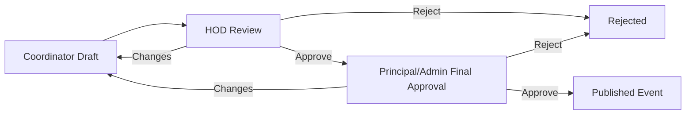

# Product Requirements

## Product Vision

LINKS is the primary campus hub for MITT. It helps students, faculty, HODs, student coordinators, placement officers, principal, alumni, clubs, departments, and admins discover, publish, approve, track, and measure campus activity.

LINKS is not a chat platform. It is the official operating layer for campus updates, events, opportunities, approvals, applications, and records.

## Primary Users

- Students
- Student coordinators
- Faculty
- Heads of department
- Placement officer
- Principal
- Alumni
- Club organizers
- Admins

## Core Product Goals

For students:

- Know what is happening in college.
- See department-specific updates.
- Discover jobs, internships, events, clubs, and alumni.
- Apply to opportunities.
- Track application status.
- RSVP to events.
- Maintain a public verified profile.

For college offices:

- Publish updates to the correct audience.
- Approve event requests.
- Track participation.
- Post placement opportunities.
- Collect application data.
- Shortlist students.
- Export reports.

## MVP Scope

Must have:

- Admin/HOD-managed student access
- USN-based identity
- Gmail invite or manual approval flow
- Public verified profiles
- Role-based dashboards
- Campus directory
- Targeted announcements
- Event proposal and approval workflow
- Placement opportunities
- Internal and external application tracking
- Shortlisting and status updates
- Notifications for placement links, important announcements, approvals, and status changes
- CSV exports
- Admin role management

Should have:

- Clubs and department pages
- Saved jobs/events
- Alumni mentorship requests
- In-app, email, and web push notifications
- Media uploads
- Search

Not in MVP:

- Real-time chat
- Stories
- Social feed
- Mobile app
- Complex recommendations

## Key Workflows

### Student Access

```mermaid
sequenceDiagram
    Student->>LINKS: Request account or receive Gmail invite
    LINKS->>Admin/HOD: Pending verification
    Admin/HOD->>LINKS: Verify USN and student details
    LINKS->>Student: Account activated
    Student->>LINKS: Complete public profile
```

### Faculty Targeted Update

Example: EC faculty shares a lab update.

1. Faculty creates announcement.
2. Faculty selects EC department, target year/batch, and student role.
3. HOD/admin approval is applied if required.
4. Only matching students see the update.

### Event Approval



### Placement Opportunity

1. Placement officer posts opportunity.
2. Eligibility is defined by branch, batch, year, CGPA, skills, or other rules.
3. Eligible students see it.
4. Students apply internally or mark external application completed.
5. Placement officer shortlists and updates statuses.
6. Reports can be exported.

## Success Metrics

- Weekly active students
- Announcement reach by department
- Event RSVPs
- Placement applications per opportunity
- Shortlisted and selected student counts
- Club interest submissions
- Admin approval turnaround time

## Decided Product Rules

- USN is the primary student identity key.
- Gmail can be used for invites if the college already has student Gmail records.
- HOD/admin manual approval is the fallback.
- Profiles are public, but private contact fields are protected.
- Students can choose whether to show email and professional links such as LinkedIn.
- Announcements must support targeted audience rules.
- Student coordinator events need HOD review and principal/admin final approval.
- Faculty mentors are optional unless college policy requires them.
- Placement officer owns placement opportunity workflows.
- Applicant data is sensitive.
