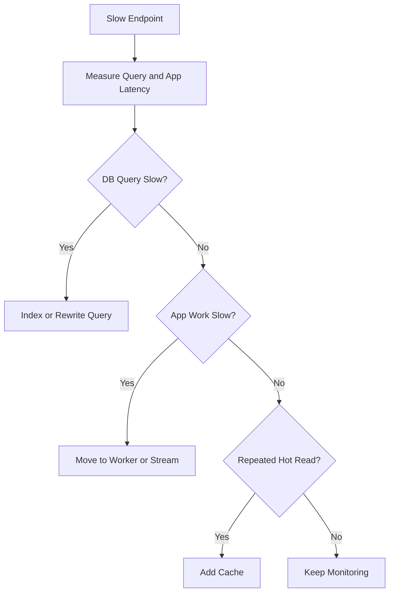

# Scaling

## MVP Scaling Strategy

Start simple:

- One Go API service
- PostgreSQL
- Object storage
- Email provider
- No Redis unless needed
- No worker unless needed

## Performance Rules

- Use indexes.
- Paginate every list.
- Avoid N+1 queries.
- Use selective GORM preloads.
- Stream large exports.
- Keep dashboard queries explicit.
- Use context cancellation.

## Search

Start with PostgreSQL full-text search and trigram indexes.

Search targets:

- Profiles
- Events
- Announcements
- Opportunities
- Clubs
- Departments

Move to Meilisearch/OpenSearch only if PostgreSQL search becomes insufficient.

## Caching

Do not cache early.

Add Redis later for:

- Dashboard summary caching
- Rate limiting
- Session/token metadata if needed
- Expensive repeated queries

Cache invalidation candidates:

- Announcement publish/update
- Event approval/update
- Opportunity publish/update
- Application status change

## Background Jobs

Add workers when synchronous work becomes slow.

Worker candidates:

- Email notifications
- CSV export generation
- Scheduled deadline reminders
- Image processing
- Search indexing

## Database Scaling

Step-by-step:

1. Add indexes.
2. Optimize queries.
3. Add pagination.
4. Add caching for hot reads.
5. Add read replicas for reports.
6. Split services only after module ownership or traffic requires it.

## Scaling Decision Flow

