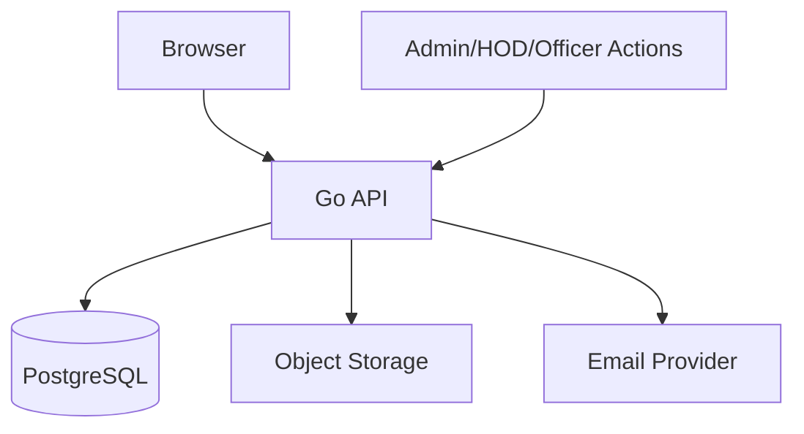

# Security

## Security Model

LINKS handles sensitive data:

- Student identity
- USNs
- Contact details
- Applicant data
- Shortlisting status
- Admin/HOD actions
- Placement exports

Security must be enforced at every layer.

## Trust Boundaries



Each boundary must validate inputs, authenticate users, authorize actions, and log sensitive changes.

## Authentication Security

- Prefer Argon2id for password hashing.
- Bcrypt is acceptable initially.
- Store refresh tokens hashed.
- Rotate refresh tokens.
- Revoke tokens on suspension/password reset.
- Pin JWT signing algorithm.
- Use issuer and audience claims.

## Cookie and CSRF

- Refresh cookies must be `HttpOnly`.
- Use `Secure` in production.
- Use `SameSite=Lax` or `SameSite=Strict`.
- Prefer `__Host-` prefix.
- Clear cookies on logout.
- Add CSRF protection for state-changing cookie-authenticated requests.

## CORS

- Use explicit origin allow-list.
- Do not use wildcard CORS with credentials.
- Configure origins per environment.

## HTTP Security Headers

Set:

```text
Content-Security-Policy
X-Frame-Options
X-Content-Type-Options
Referrer-Policy
Permissions-Policy
Strict-Transport-Security
```

Enable HSTS only on HTTPS environments.

## Input Validation

Validate:

- USN
- Email
- Phone
- URLs
- Role scopes
- Department codes
- Event dates
- Opportunity deadlines
- File MIME type
- File size
- CSV import size and row count

## Privacy Rules

Public by default:

- Name
- Role
- Department
- Batch/designation
- Headline
- Skills/interests
- User-selected professional links
- Profile photo

Private by default:

- Phone number
- Email unless user enables it
- Placement application data
- Shortlisting status except to authorized viewers

## Applicant Data

Allowed viewers:

- Student for own application
- Placement officer
- Principal
- Admin
- HOD only as department-level summary unless explicitly allowed

## Audit Logging

Audit:

- User verification
- Role assignment
- Account suspension/restoration
- Event approval decisions
- Announcement approvals
- Placement status changes
- CSV exports
- Applicant list views where possible

## Security Testing

Run:

```text
go test -race ./...
govulncheck ./...
gosec ./...
```

Security test cases:

- Student cannot see another student's application.
- HOD cannot approve another department's event.
- Faculty cannot publish to unrelated departments.
- Suspended user cannot access APIs.
- Private profile fields are hidden.

## Public Repository Considerations

The LINKS repository is public as of 2026-07-16. This affects the threat model in the following ways:

- **Code visibility**: All source code, including security controls, is visible to potential attackers. Security must rely on proper implementation, not obscurity.
- **Secrets hygiene**: Extra vigilance is required to ensure no secrets, API keys, or credentials are ever committed. Pre-commit hooks and CI secret scanning are recommended.
- **Automated review**: CodeRabbit runs on every PR as an additional review layer, catching common security issues (injection patterns, hardcoded secrets, unsafe patterns) before merge.
- **Branch protection**: The `master` branch is protected — all changes require a PR, preventing bypass of review controls.

